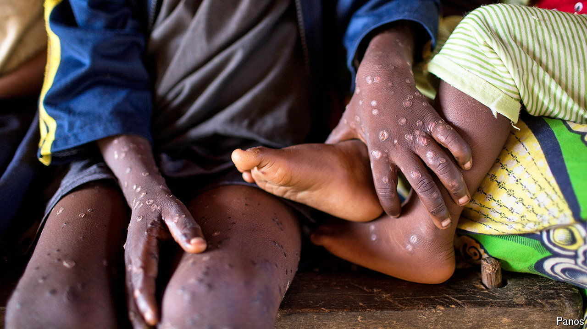

###### Viruses

# A deadly new strain of mpox is raising alarm 

##### Health officials warn it could soon spread beyond the Democratic Republic of Congo 

 

> Jun 26th 2024 

MPOX IS A viral infection typically found in parts of Africa and spread through contact with infected animals as well as within households. It causes severe fever, flu-like symptoms and a rash of pus-filled blisters across the body. In 2022 the disease, formerly known as monkeypox, spread around the world—cases turned up everywhere from Nigeria to America and Australia. A newly discovered strain of the virus, described by some researchers as the most dangerous yet, now threatens to spread beyond the Democratic Republic of Congo into neighbouring countries such as Rwanda, Burundi and Uganda. 

Although much remains unknown about this strain, Jean Claude Udahemuka, a lecturer at the University of Rwanda who has been studying the outbreak, reports fatality rates of approximately 5% in adults and 10% in children. The virus exhibits different transmission patterns and disproportionately affects children. On June 25th the World Health Organisation emphasised the urgent need to deal with the surge of mpox cases in Africa.

