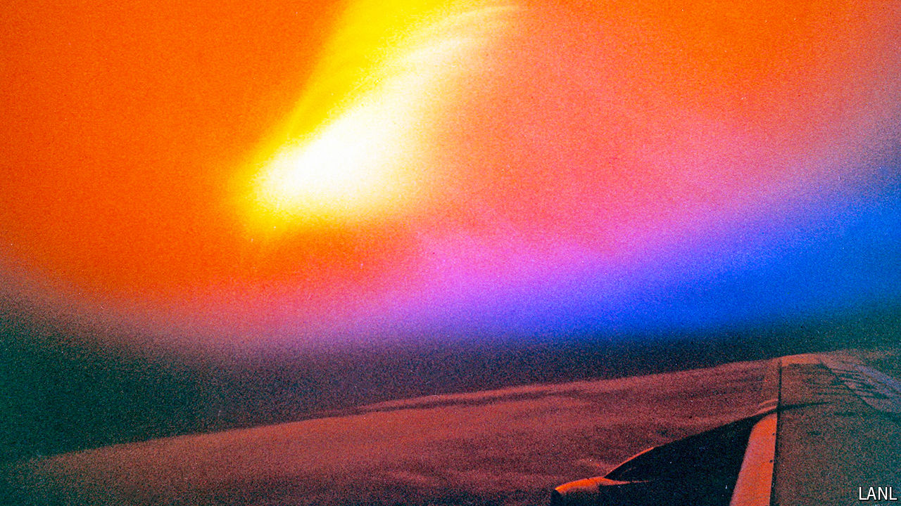

###### High alert on high

# The race to prevent satellite Armageddon 

##### Fears of a Russian nuclear weapon in orbit are inspiring new protective tech 

 

> Jun 27th 2024 

IN EARLY 2021 Micross Components, a designer of highly specialised circuitry in Melville, New York, received an intriguing request. An American aerospace giant wanted components that could protect a military system’s electronics from the radiation generated by a nuclear detonation. Micross signed the contract, and set about doing the work, but was left in the dark about why such a system would be needed. The puzzle pieces fell into place earlier this year, says Mike Glass, a product manager at Micross, when American officials began to talk about Russian plans to place a nuclear weapon in space.

That talk was motivated by a Russian satellite called Cosmos-2553, which is thought to be secretly testing the necessary electronics some 2,000km above Earth’s surface. A nuclear detonation there would probably be too high to wreak any meaningful direct damage on the surface of Earth. But it could cause what Lieutenant-Colonel James McCue, an outgoing official with America’s Defence Threat Reduction Agency, calls a “satellite Armageddon”. Many of the nearby spacecraft tightly packed in lower orbits would be immediately fried; a greater number farther afield would slowly succumb to the radioactive aftermath. The blast would affect all countries’ satellites indiscriminately.

