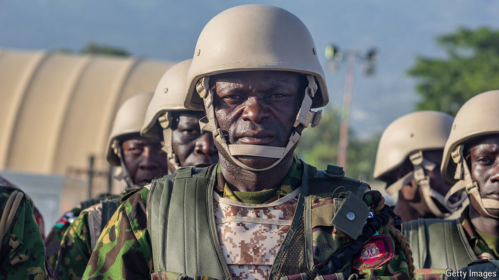

###### Mission impossible

# A Kenyan-led security mission finally starts to arrive in Haiti 

##### But can it make a difference? 

 

> Jun 27th 2024 

CLichéd wisdom suggests that those who wait are rewarded for doing so. Haiti’s 12m people are about to find out whether this applies to them. The first contingent of an international police mission tasked with bringing stability to the gang-racked country landed in the capital, Port-au-Prince, on June 25th. Their mission begins eight months after the UN authorised the force, 20 months after Haiti’s government requested it. 

The arrival of the Multinational Security Support Mission (MSS), led by Kenya, had been trailed for weeks. Its expansion will be gradual: some 400 police officers disembarked from a Kenya Airways plane wearing fatigues and carrying weapons. They expect to be joined by police from another eight countries, bringing the force’s number to 2,500. 

