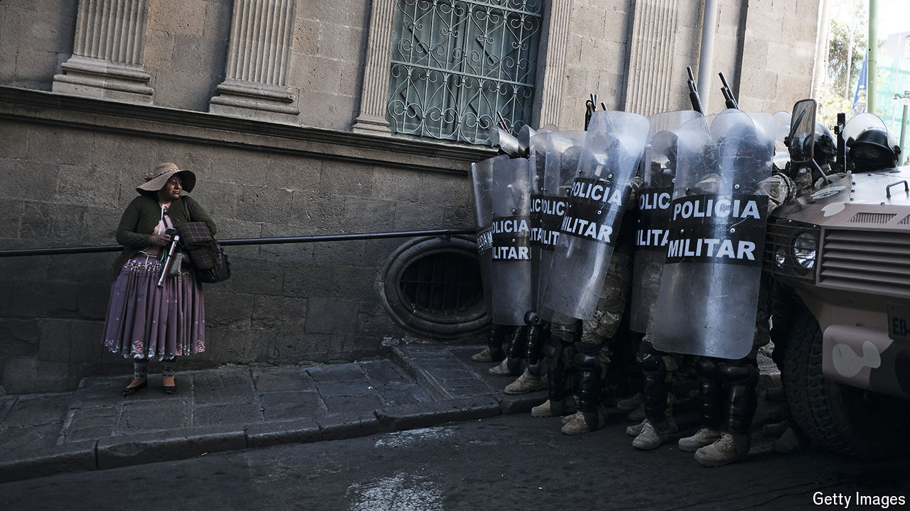

###### Chaos in the Andes

# An apparent coup in Bolivia founders, but the country remains in trouble 

##### The sight of armoured vehicles ramming the presidential palace will scare investors away 

 

> Jun 27th 2024 

The soldiers and armoured vehicles that swarmed through La Paz, Bolivia’s capital, on June 26th had one destination: the presidential palace. After a small tank repeatedly rammed its doors, soldiers pushed inside. The leader of the uprising then revealed himself as Juan José Zúñiga, the commander of the armed forces until his sacking on June 25th. “There will be a new cabinet of ministers,” he told reporters. Politicians had to “stop destroying, stop impoverishing our country, stop humiliating our army”. The army was trying to install “a true democracy”. The army, he underscored, “did not lack balls”.

Nor, it seemed, did President Luis Arce. At one point he emerged to argue with the putschists face-to-face. Returning inside, he managed to hold a ceremony to appoint new heads of the armed forces, over the booming of tear gas being fired at pro-democracy protesters outside. It was an “atypical” day, he noted dryly, but swore “we will defeat any coup attempt.” He called on  to mobilise to defend democracy, but also to stay calm. The new top brass demanded all soldiers return to the barracks. Meanwhile one of Bolivia’s biggest unions announced a general strike in protest at the coup attempt. Condemnation of the attempted putsch poured in from leaders across the world.

