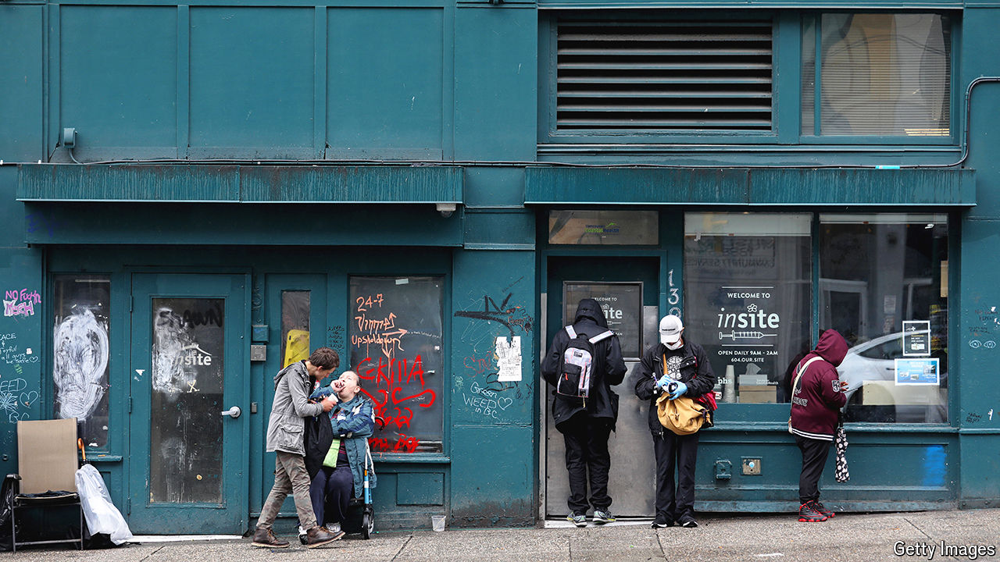

###### Canada’s overdose capital

# Vancouver pioneered liberal drug policies. Fentanyl destroyed them 

##### So-called harm reduction measures have become a rod for Justin Trudeau’s back 

 

> Jun 27th 2024 

He is unconscious, barely breathing, sprawled on a pavement in downtown Vancouver. When the firefighters arrive, a bystander explains that the man has overdosed on fentanyl, a powerful synthetic opioid. While one firefighter pumps oxygen into the victim’s mouth, another injects him with naloxone, which reverses the chemical effect of opioids. The first shot does nothing; a second is administered. The man sits up, then stumbles to his feet. Refusing all offers of further help, he staggers away down the street. The firefighters can only watch him go. 

Blessed with stunning scenery, mild weather and low crime, Vancouver regularly tops lists of the world’s most liveable cities. For years, along with British Columbia’s provincial government, it has pioneered a programme to curb drug-related deaths known as harm reduction. Health authorities began handing out clean needles in the late 1980s and later added free crack pipes. North America’s first supervised injection facility opened in Vancouver in 2003. The city launched a trial prescription-heroin programme (in addition to ones offering lower-potency methadone) in the mid-2000s. In the following years, HIV and hepatitis C infections fell. The number of drug-induced deaths dropped from a record 400 in 1998 to 183 in 2008. Harm reduction seemed a success. 

