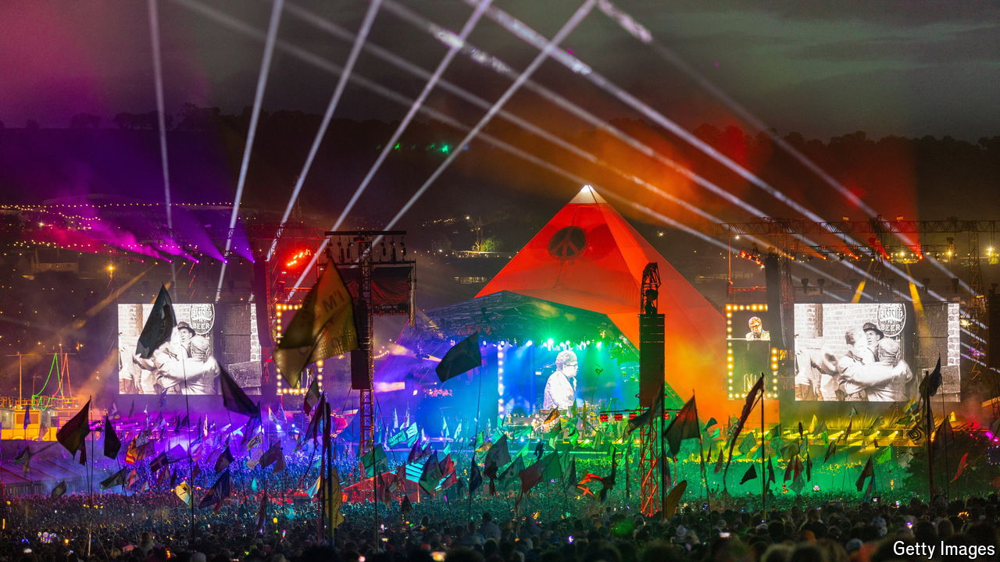

###### The Economist reads

# Books (and films) about the joy and pain of music festivals 

##### From Bethel to the Bahamas 

 

> Jun 25th 2024 

STARTING ON JUNE 26th more than 200,000 people will arrive in rural Somerset, in south-west England, for the Glastonbury festival. They are anticipating rockin’ music, phenomenal art, idyllic camping, beautiful weather, delicious cider and togetherness with like-minded souls. If they also endure long journeys, mud, stinking toilets, overpriced food and enormous crowds, most will quickly forget about that part of the experience. Such scenes happen across the world every summer as millions of people flee the drudgery of normal life. Millions more will watch festivals from their sofas, promising themselves that next time they will join the throng. This collection of books and films about festivals in Britain and America may encourage them, and remind the faithful of the magic that such gatherings can create. All are nostalgic. Some celebrate spectacle. Others are reminders of the hard work that goes into putting on a party, and how badly one can go wrong.

By Michael Lang and Holly George-Warren. 

