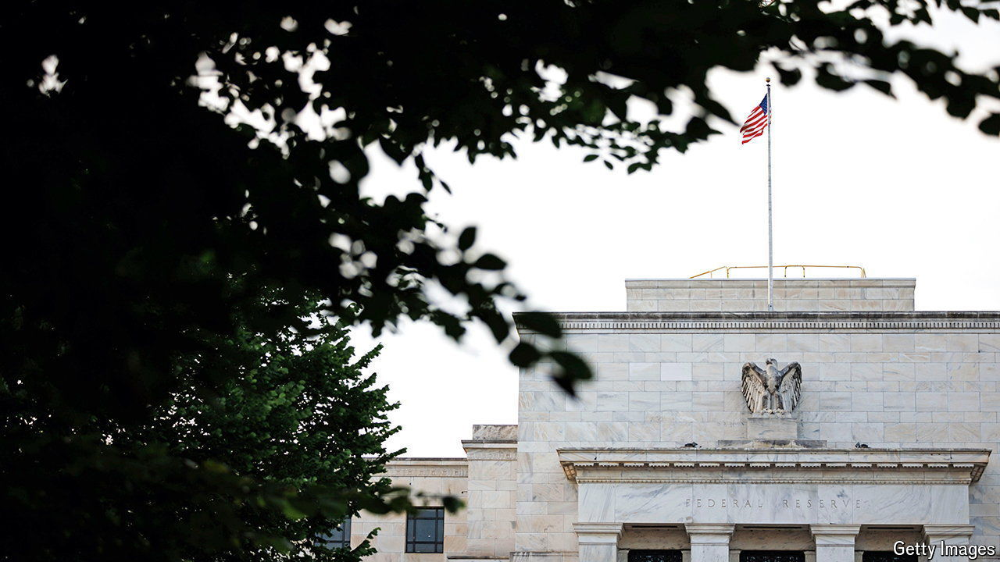

###### The world this week

# Business 

#####  

 

> Jun 27th 2024 

The Federal Reserve released the results of its annual , which assess how banks would cope with a severe global recession and meltdown in the property market. All 31 of the banks, including Bank of America, JPMorgan Chase and Wells Fargo, passed the Fed’s baseline scenario, meeting their minimum capital ratios, though the aggregate ratio, a cushion against losses, fell from 12.7% to 9.9%. The bank’s combined hypothetical losses reached $685bn. 

 announced that it would pass on the cost of complying with new emissions regulations to passengers. The German airline will introduce an “environmental-cost surcharge” of between €1 and €72 ($77) on flights that depart from the EU, Britain, Norway and Switzerland after December 31st. Lufthansa said this was to help cover a European rule ensuring that at least 2% of airlines’ fuel consumption comes from more-expensive sustainable aviation fuel, as well as other green tape. 

