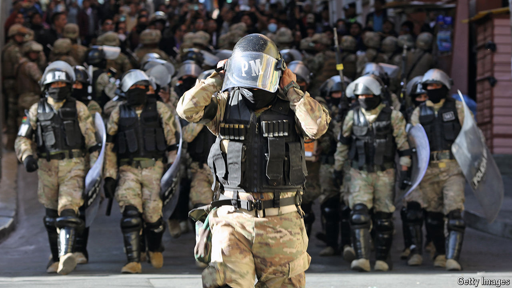

###### The world this week

# Politics 

#####  

 

> Jun 27th 2024 

A disgruntled general led an attempted coup in . Troops aligned with General Juan José Zúñiga stormed the presidential palace in La Paz, the capital, before pulling back as momentum slipped away. Some Bolivians also took to the streets to condemn the coup attempt. Luis Arce, the president, called for international support. General Zúñiga had been sacked recently after he said he would stop Evo Morales, a former leftist president, from running for office again in next year’s election. 

Juan Orlando Hernández, who was president of  from 2014 to 2022, was sentenced to 45 years in prison by a judge in Manhattan for enabling the transport of cocaine to the United States. Mr Hernández took millions of dollars in bribes, telling friends that he would stuff cocaine “right up the noses of the gringos”. 

