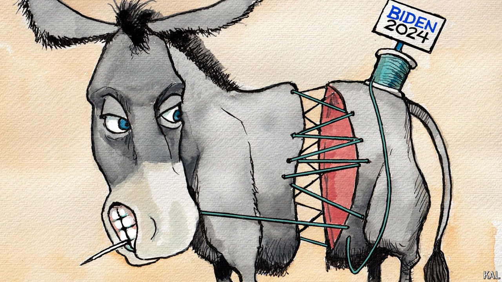

###### Lexington

# In New York, the Democratic establishment strikes back 

##### But the defeat of one progressive congressman shows how deep the party’s divisions run 

 

> Jun 26th 2024 

YOU MIGHT expect a party’s leaders to inspire its activists about an upcoming election by invoking the vision of their standard-bearer. But on a recent sweltering Saturday afternoon, in a park in the Democratic stronghold of the South Bronx, in New York, Democrat after Democrat, including three congressmen and a senator, spent 75 minutes addressing a crowd of more than a thousand without mentioning President .

For all the enthusiasm, there was, in retrospect, a touching quality to the scene, and not only because the congressman who was the focus of the rally, Jamaal Bowman, would go on to lose his primary three days later, on June 25th. It captured the predicament Mr Biden has presented to his party’s leftists, and that they are presenting him in return. Can they praise Mr Biden, and he them, without alienating key supporters? Can they criticise one another to court such supporters without helping ? 

