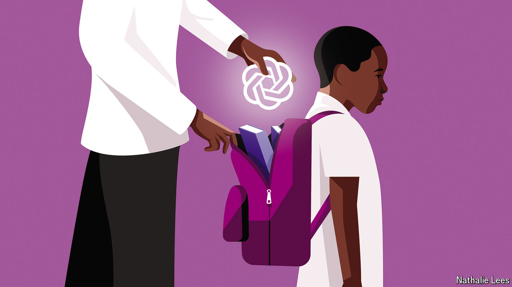

###### AI and parenting

# Non-white American parents are embracing AI faster than white ones 

##### The digital divide seems to have flipped 

 

> Jun 27th 2024 

In America, technology tends to reach non-white people last. Non-white families got landline telephones later than white ones. Today they lag behind in computer ownership and broadband access. This “digital divide” showed during the pandemic, when many non-white pupils struggled with remote learning. When artificial intelligence (AI) spread with the release of ChatGPT in 2022, so did fears about the disparities that might follow. 

Yet AI is disrupting the digital-divide narrative. It is true that algorithms have disadvantaged black and Hispanic people in health care, policing and the court system. Facial-recognition software continues to struggle with non-white faces. Some AI chatbots have generated racist content. But when it comes to using AI personally, non-white families may be getting an edge. 

