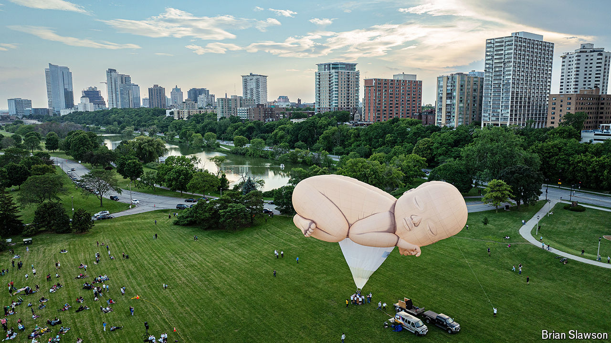

###### Push and Pulaskix

# Przekrój, an iconic Polish magazine, relaunches in America 

##### It shows the surprising resilience of European diasporas 

 

> Jun 27th 2024 

On June 21st visitors to Veterans Park in Milwaukee caught an unusual spectacle. In the late-afternoon sun, a hot-air balloon in the shape of a giant baby was filled up, as a choir sang. The stunt was to promote the launch of the first ever English-language edition of(Cross-section), a Polish cultural magazine that was influential in the cold-war era. The baby, according to Maria Kozak, the magazine’s Polish-American editor-at-large, was intended to symbolise rebirth: “Babies are free of social biases. They have this completely unlimited potential.” 

And so, she hopes, does her magazine. The new edition of  will be a test of whether Polish-Americans, once a powerful voting bloc in the Midwest, still hold together as a diaspora.

