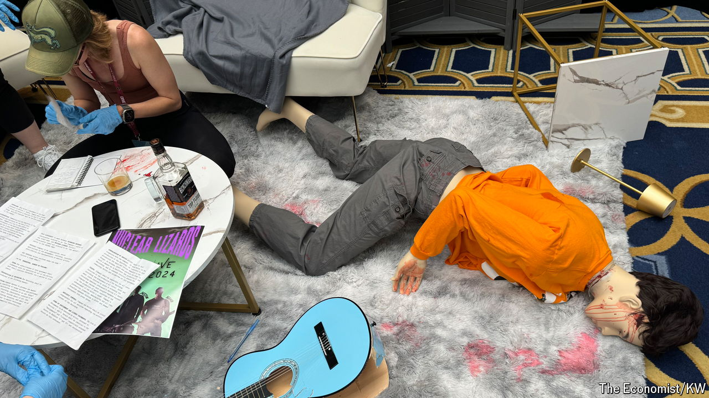

###### Forensic fandom

# True-crime fans are banding together online to try to solve cases 

##### Yikes 

 

> Jun 24th 2024 

It is 9am on a Sunday and Liz is trying to figure out who did it. Specifically: who killed this guy splayed across the floor? In her day job Liz is a massage therapist, but today she is a homicide detective—or rather she is cosplaying one. Wearing blue latex gloves she prods a blood-soaked mannequin by her feet, part of a crime-scene simulation at CrimeCon, a convention for true-crime fans. Liz came to learn from the experts. They start with the basics: it is blood , not splatter.

At CrimeCon there are panels on topics ranging from sextortion to forensic entomology (“beetles feed on dry remains”, “moths are not predacious”). There are sessions dedicated to famous cold cases and meet-and-greets with authors and podcasters. There is merch for sale: pepper spray, stun guns, cocktail covers to guard against date rape. And there are lots of other enthusiasts to befriend. “It’s not a celebration of crime, it’s a learning of crime,” says Liz’s friend. Except everyone does seem to be having a very good time.

