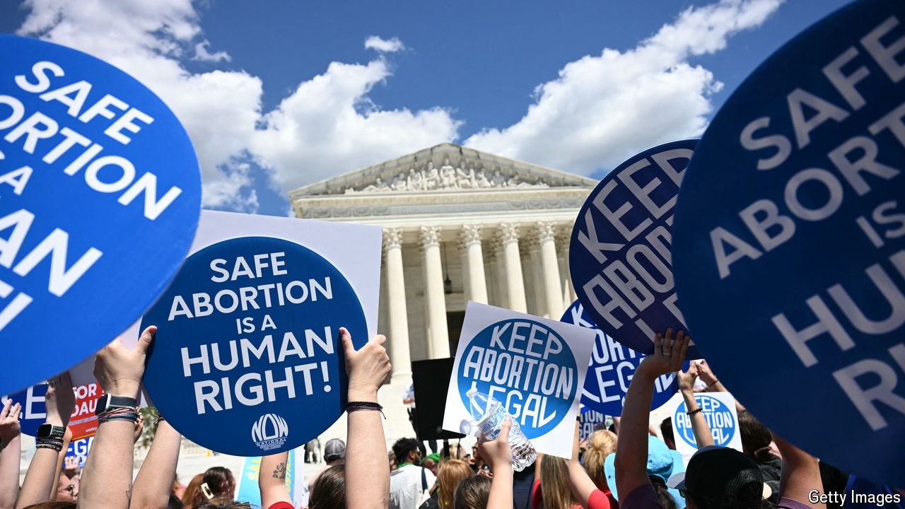

###### A SCOTUS snafu

# What to make of the US Supreme Court’s latest abortion ruling 

##### The justices’ rulings sometimes seem deliberately hard to follow 

 

> Jun 27th 2024 

Moyle v United States

THE SUPREME COURT loves to keep America guessing. The justices say which days they “may announce opinions” but offer no whisper of which rulings are coming on a given day. On June 26th the court managed to raise the intrigue to new heights. After just two of a dozen pending decisions were released,  fleetingly appeared on the Supreme Court’s website.

