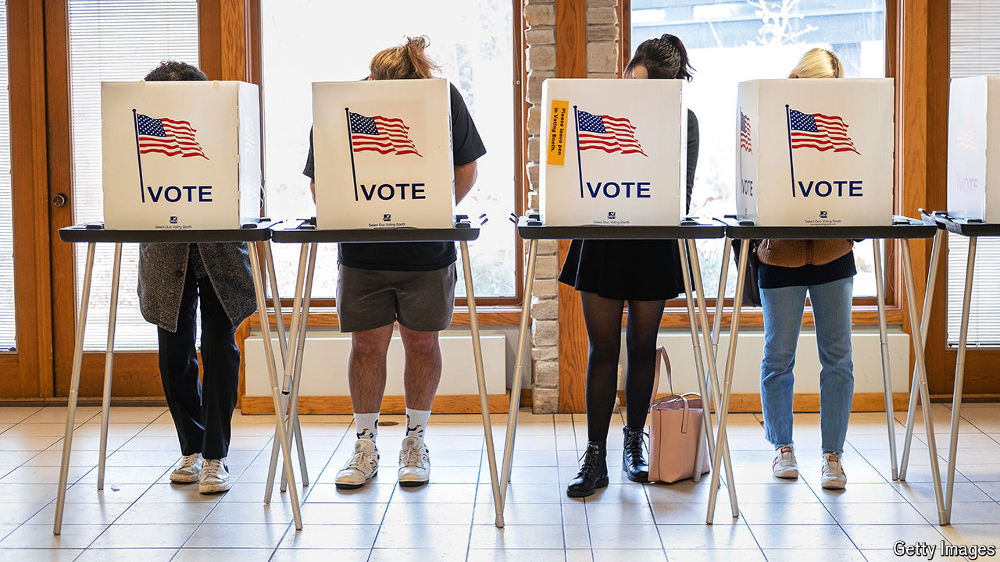

###### The enthusiasm gap

# Young voters strongly favour Joe Biden, but will they turn out? 

##### After a pummelling from campus protesters over Gaza, the president is struggling to get his message across 

 

> Jun 27th 2024 

Fretting about the youth vote is a Democratic pastime. This year, there are obvious causes. At the top of the ticket, 81-year-old Joe Biden struggles to convey the vitality that his 78-year-old opponent musters. Student protesters chanting “Genocide Joe” blame Mr Biden for civilian suffering in Gaza. On TikTok, young leftist influencers attract millions of views for videos urging voters to reject him.

Tour college campuses, however, and you will find plenty of young voters ready—excited, even—to cast a ballot for Mr Biden. “He has been the most progressive president we’ve ever had,” raves Ian Moore, a 20-year-old student executive-board member of the University of Michigan’s College Democrats, an arm of the Democratic National Committee. “Yeah, he’s a little older, he’s a little less exciting,” he acknowledges, “but he gets the job done.”

