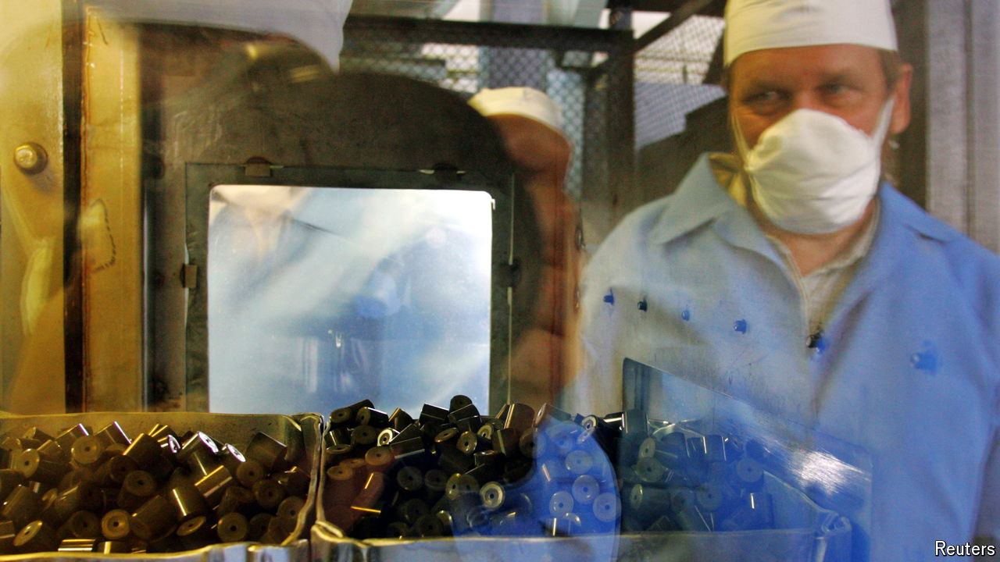

###### Going nuclear

# Demand for uranium is booming. Who is benefiting? 

##### One Central Asian country stands out above the rest 

 

> Jul 4th 2024 

On July 3rd Vladimir Putin, Russia’s president, and Xi Jinping, China’s leader, attended the annual summit of the Shanghai Co-operation Organisation, a Eurasian security and defence partnership, in Astana, Kazakhstan’s capital. In a statement ahead of his meeting with Kassym-Jomart Tokayev, Kazakhstan’s president, Mr Xi emphasised the need for the two countries to strengthen their co-operation in energy investment and mining. It hints at an area where the “no-limits” friendship between Russia and China is being tested, as they both woo Kazakhstan. 

The war in Ukraine exposed Europe’s dependency on Russian oil and gas. This has given a boost to nuclear advocates and increased the demand for uranium, the mineral used for nuclear fuel. Global uranium production is projected to reach over 75,000 tonnes by 2030, up from around 65,000 tonnes last year. Uranium prices have multiplied five-fold since 2016, heavily driven by China’s ballooning demand (though they have cooled a bit recently). 

