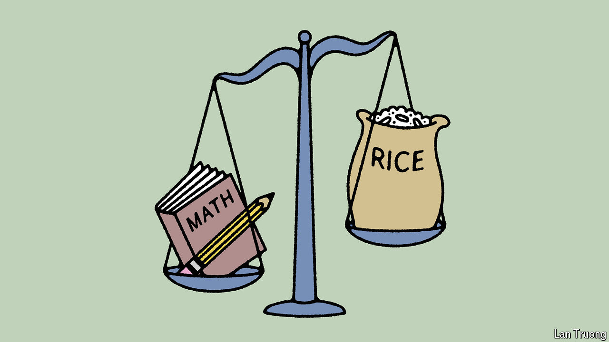

###### Banyan

# Indians have grown used to getting nice things from politicians 

##### But it’s no longer enough to win votes 

 

> Jul 4th 2024 

AN INDIAN receiving any sort of benefit from the government in recent years was left in little doubt of whom to thank. Got vaccinated against covid? Narendra Modi, the prime minister, beamed from the certificate. Applied for housing under a 50-year-old programme? The words  (prime minister) were written all over the paperwork. Received a cash injection from the state government? Probably advertised by posters displaying the relevant chief minister’s visage.

Welfare politics has been a longstanding feature of India, but Mr Modi and his Bharatiya Janata Party (BJP) sought to perfect the art of loudly claiming credit for doling out benefits to ordinary people. For a period it was a reliable electoral tool, establishing the prime minister and his party as benefactors to the poor. The BJP’s rivals joined the welfarist bandwagon, hoping for a similar effect. Yet the recent election, in which the BJP lost its majority, shows that the tactic may have run its course.

