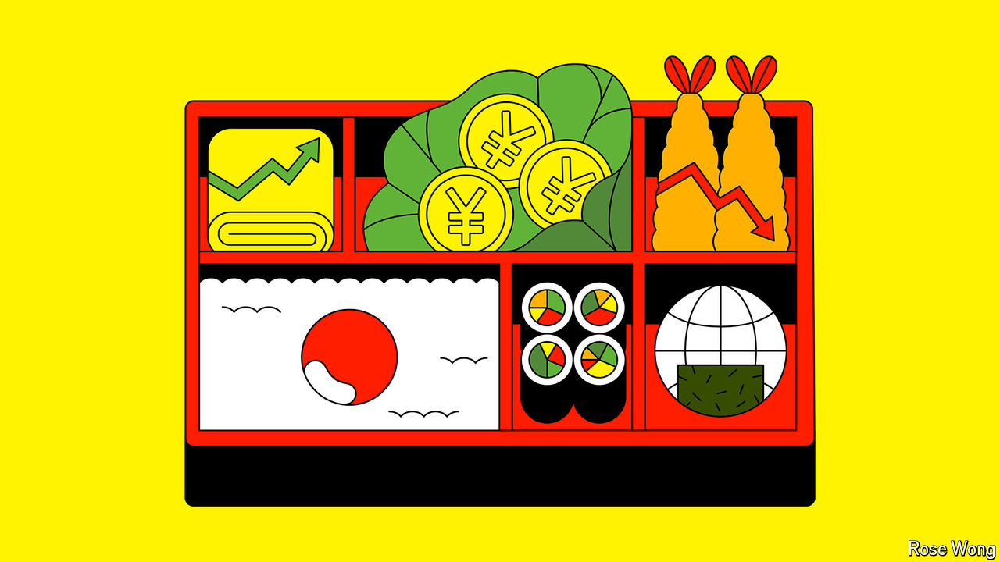

###### A new era begins

# Japan’s mind-bending bento-box economics 

##### The paradox of red-hot labour markets, falling demand and rising prices 

 

> Jul 1st 2024 

For much of the past three decades Japan’s economy has been defined by deflation, stagnation and fading global relevance. That is no longer the case. Between 1991 and 2021 Japan’s annual inflation rate averaged 0.35%. Inflation has been above 2% every month since April 2022. In March the Bank of Japan (BoJ)  for the first time in 17 years, doing away with the world’s last experiment in negative interest rates; it will debate another rise at its next meeting at the end of this month. The blue-chip Nikkei stock index broke its  this February; the Topix, a broader benchmark index, hit its highest level since 1990 last week. It seems that the lost decades are over. 

But what comes next? Some see opportunity. Japan, the optimists crow, is back—this time for real. Morgan Stanley, a bank, touts a “revitalised Japan”. Higher inflation and more dynamic companies will put the country back on a growth trajectory, allowing it to keep its public debt in check and hang on to its place among the world’s top economies. Japan has become a destination for high-tech firms seeking to reinforce supply chains: TSMC, the Taiwanese semiconductor giant, is pouring billions of dollars into new manufacturing plants. 

