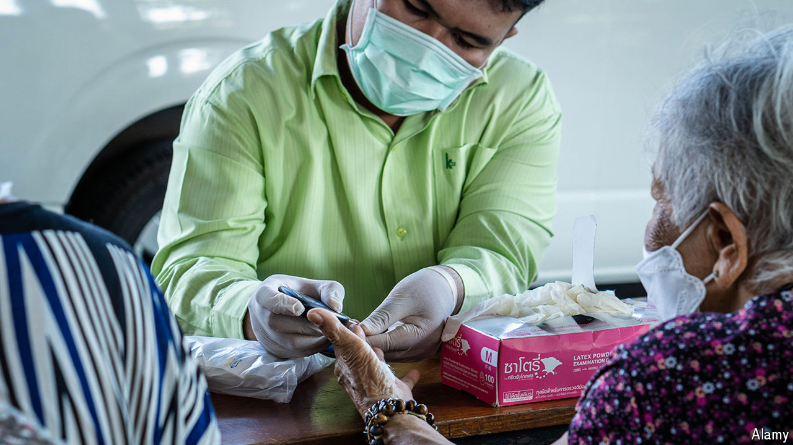

###### An Asian model

# Why is Thai health care so good? 

##### The country could become a model for the region 

 

> Jul 4th 2024 

Political turmoil in Thailand is unrelenting. Over the past two decades, 11 different prime ministers have led the country. In the coming weeks that number could increase, as the constitutional court considers dismissing the current leader, Srettha Thavisin, over an allegedly illegal cabinet appointment. Yet amid such instability, one aspect of Thailand’s governance flourishes: its public-health system.

Thai health care is among the most effective in the world. The average Thai can expect to live to 80, much longer than their regional counterpart (the South-East Asian figure is 73) and even slightly longer than the average American and European (each roughly 79), according to the latest data from the United Nations. Last year a whopping 99.5% of the population of 72m was covered by health insurance. Remarkably, Thailand has achieved this as a developing country: its income per person was roughly $7,000 in 2023, more than 11 times smaller than America’s. Even in the middle of the pandemic in 2021, its public-health bill was 6% of GDP, compared with 17% in America and 11% in the European Union.

