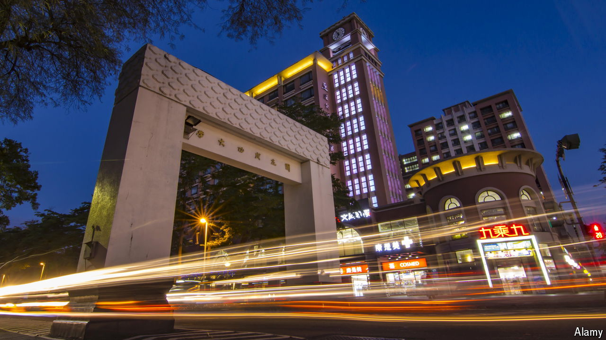

###### The strange death of liberal arts

# Why many young Asians are no longer studying history 

##### One city-state is bucking the regional trend 

 

> Jul 4th 2024 

With cannons on campus, its own Qing-dynasty wall and the first Dutch fort in Taiwan nearby, National Cheng Kung University seems an appealing place for a budding historian. However, after a first round of applications, no students had accepted places in the history department for next year. It is a shock for the university, ranked third in Taiwan. But it is part of a broader trend.

In much of East Asia, universities face a demographic crisis. In Japan the population of 18-year-olds has been declining since the 1990s. In Taiwan the undergraduate population has dipped by more than a quarter in the past decade. Experts in South Korea talk of an “enrolment cliff”, as 3.6m students in 2010 fell to 3m last year.

