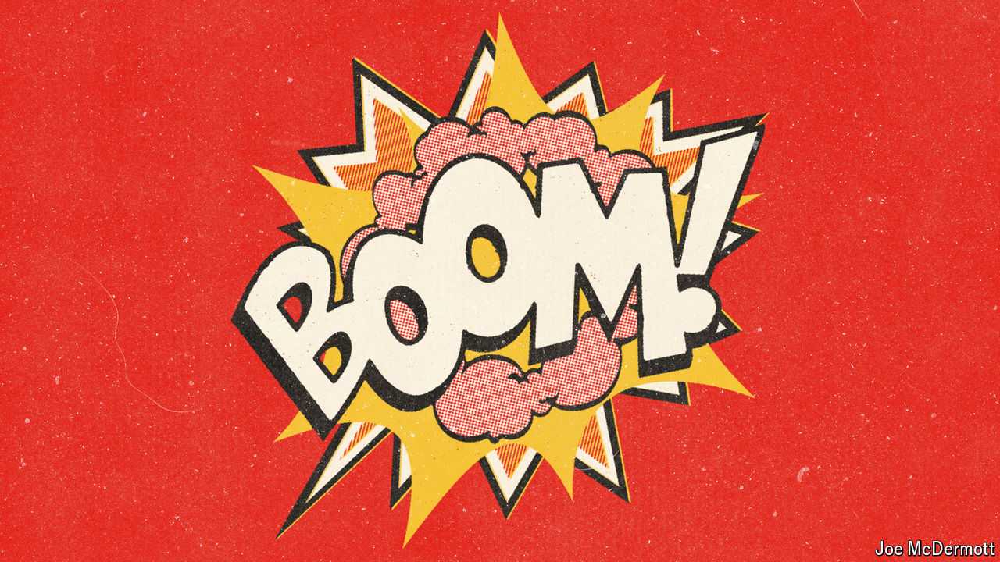

###### A new podcast

# Introducing “Boom!” 

##### A six-part series about the generation that blew up American politics 

 

> Jul 4th 2024 

WHY HAVE Americans born in the 1940s, like Donald Trump and Joe Biden, had such a stranglehold on American power, and why do they cling on to it so tightly? To answer this, our US editor has interviewed dozens of prominent Americans born in the same decade. The result is a new  that begins this week. It is called “Boom! The generation that blew up American politics”.

Born around the same time as the atom bomb, they grew up in a country that was pre-eminent in technological, military and economic terms. Fear of mutually assured destruction lurked in their childhoods, but it was mostly blocked out by comforting domesticity. People form their political views between their mid-teens and mid-20s. For this group that time was the late 1960s, a decade of possibilities cut short by war, assassinations and street violence. Episode 1 focuses on 1968, the origin story of America’s extreme partisanship.

