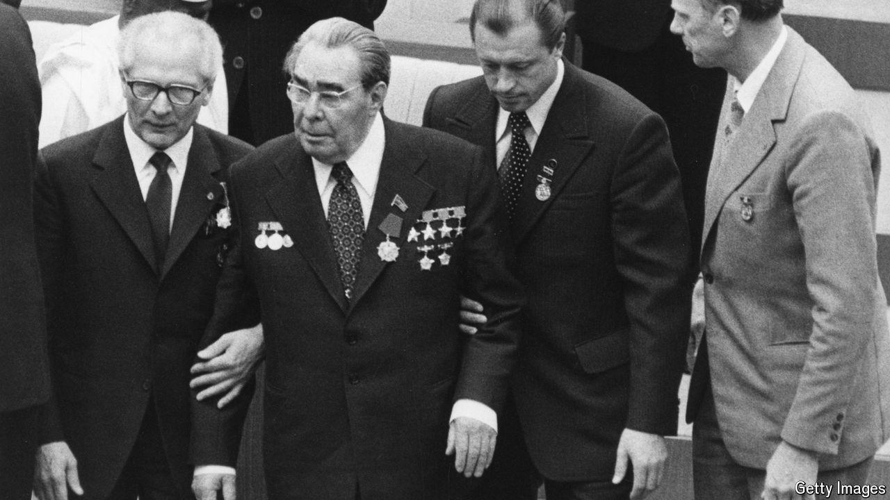

###### President Lear

# Senility in high office 

##### Even leaders who are spry for their age eventually lose their grip 

 

> Jul 3rd 2024 

History, science and common sense concur: even great leaders age. In 1953, during his second stint as prime minister, Winston Churchill had a stroke after dinner. “No one seemed alarmed by [his] slurred speech and unsteadiness on his feet, one of the advantages of having a reputation for enjoying alcohol,” writes Andrew Roberts, a historian. For several weeks, as Churchill was incapable of governing, his son-in-law and private secretary in effect ran the country. He never fully recovered, yet refused to stand down until 1955, when he was 80. “Churchill is now often speechless in Cabinet; alternatively, he rambles about nothing,” wrote Harold Macmillan, a future Conservative prime minister, in 1954. 

For most people, cognitive decline is a private tragedy, scarring loved ones but few others. When it afflicts political leaders, the damage can be catastrophic. Paul von Hindenburg, Germany’s president in 1933, was no fan of Adolf Hitler but let him become chancellor to break a political stalemate. Some historians blame this epic misjudgment on the fact that he was 85, exhausted and perhaps suffering from Alzheimer’s disease. 

