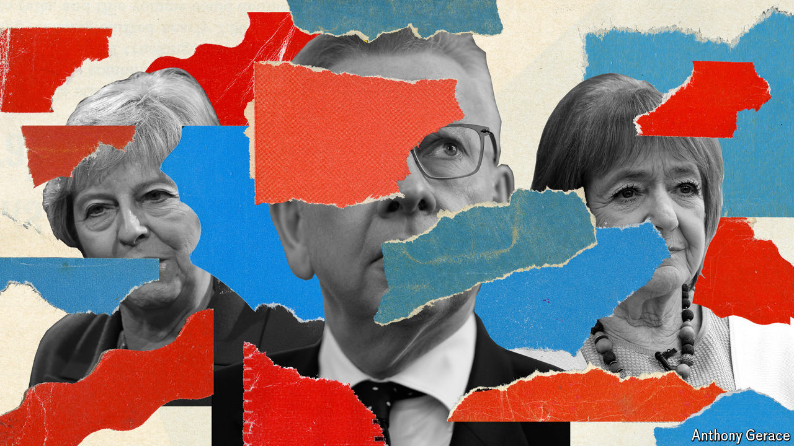

###### Political retirements

# A prime minister, a plotter and others say farewell as British MPs 

##### Theresa May is one of 132 who are departing of their own volition 

 

> Jul 3rd 2024 

Many mps, particularly from the Conservative Party, will lose their seats in the election on July 4th. But another 132 are stepping down. Some of those retiring have health problems; others dislike the job, dread a long spell in opposition or reckon they would lose. A few are well-known. Others are not, but they should be. Here is our pick of the crop. 

In a not terribly strong field,  has been the Conservative Party’s most effective minister of the past decade and a half. He pushed through colossal education reforms, which removed schools from local-authority control. England’s relative improvement in international maths and reading tests suggests they have worked. During a two-year stint in the agriculture ministry, Mr Gove laid plans for farmers to be paid not for cultivating land, as they had been for decades, but for delivering public goods like trees and bird-nesting sites. Despite loud grumbling from growers, his successors have stuck to it. 

