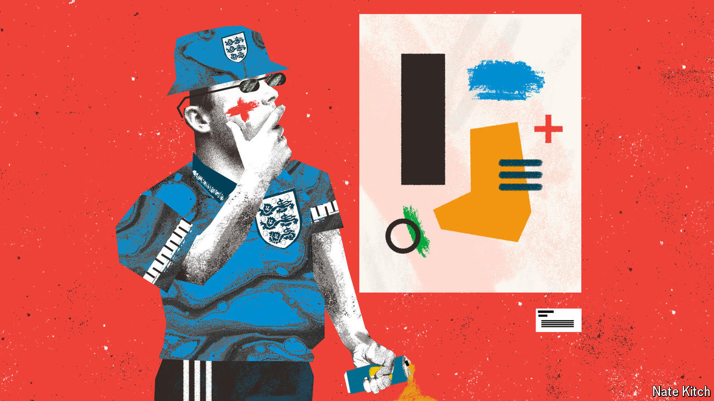

###### Bagehot

# A weekend with Gareth Southgate and friends 

##### England football fans abroad: soft boys playing at being hard men 

 

> Jul 3rd 2024 

On the 302 tram to Gelsenkirchen, a grim industrial city near the Rhine, a group of England fans are hammering the ceiling and chanting: “He comes from Barnsley/He plays in blue and white/He hates the Germans/He thinks they’re fucking shite/He’s breaking ankles, everywhere he goes/His name is Johnny, Johnny fucking Stones.” Then the tram pulls up to a stop named after Willy Brandt, a former West German chancellor. Singing about the English centre-back stops and a discussion of German historical trivia begins. “Shame his secretary was a spy,” says one of the chanters, displaying a surprisingly detailed knowledge of 1970s cold-war history. 

England’s men’s football team is the faultline where high and low culture meet. Gareth Southgate, the England manager, has become an avatar for progressive patriotism. A recent play about his tenure, , was nominated for a slew of awards. At the European championships in Germany, the other side of this fissure is on display. Englishmen take the opportunity to revel in offensive chants while they get completely wasted. Some do it with a wink, others do it with a snarl. But almost everyone joins in. 

