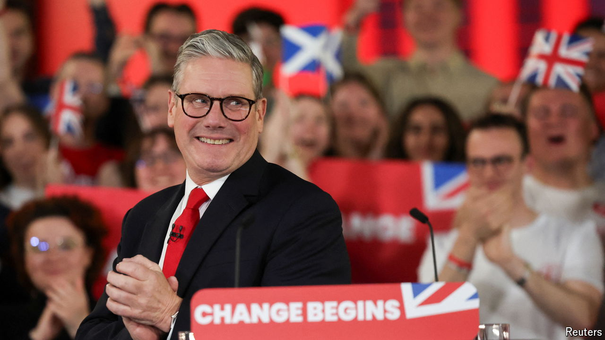
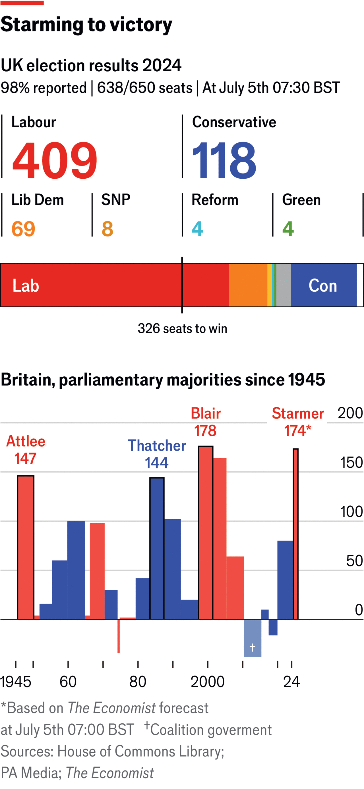
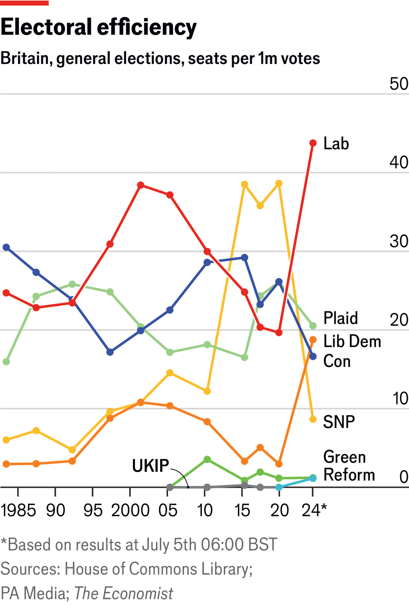
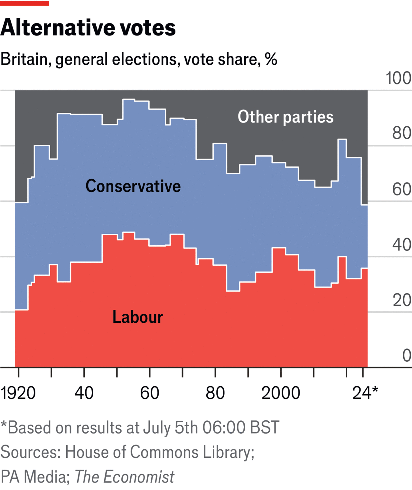

###### The British election

# Labour’s landslide victory will turn politics on its head 

##### But even with a majority this big, running bad-tempered Britain will not be easy 

 

> Jul 5th 2024 

SIR KEIR STARMER will today become Britain’s new prime minister, having led the Labour Party to a sweeping general-election victory after 14 years in opposition. Sir Keir asked the electorate for a large mandate to revive Britain’s economy and he got one. Labour’s expected  would grant him a crushing majority of at least 170. It is the largest since Sir Tony Blair, and greater than those of both Clement Attlee and Margaret Thatcher, the 20th century’s two most transformative prime ministers.

No wonder that, at a victory rally at the Tate Modern gallery in central London in the early hours of July 5th, the normally cautious Sir Keir risked an uncharacteristically elegiac tone. “We can look forward again, walk into the morning,” he crooned. “The sunlight of hope—pale at first, but getting stronger through the day—shining once again on a country with the opportunity…to get its future back.” (It started raining shortly thereafter.)


 


Thursday’s election marks one of the most successful corporate turnarounds in British political history. Sir Keir took control of a party that had been shattered by its defeat under Jeremy Corbyn in 2019. He and his lieutenants first broke the grip of the hard left, then clothed Labour in small-“c” conservative values and ran a campaign distinguished by discipline (and sometimes outright evasion). Labour’s overall vote did not increase by much but Morgan McSweeney, Labour’s campaign chief, succeeded in distributing it with brutal efficiency, pushing votes that had previously piled up in cities into the provinces. With the bulk of seats counted, Labour had collected 43 seats per million votes, up from 20 in 2019. 

 


The result also marks a sensational political collapse. The Conservative Party will be reduced to 122 seats, our latest forecast suggests. That is better than some had feared, but exceeds even its worst-ever showing, of 156 seats in 1906. Rishi Sunak, the prime minister, conceded defeat at 4.45am; he had telephoned Sir Keir to congratulate him. “The British people have delivered a sobering verdict tonight,” he said. “I take responsibility for the loss.” The fifth Conservative prime minister in 14 years, Mr Sunak failed to repair the harm done to his party by the convulsions of his four predecessors. A manifesto that promised tax cuts to pensioners and national service for the young made little difference; nor did increasingly-shrill warnings in the closing days of a Labour “supermajority”. 

The coalition that Boris Johnson built in 2019, on a promise to “get Brexit done,” has exploded. Labour cut deep into Conservative territory: claiming Hexham, which had been a Tory seat for a century; Bury St Edmunds, held for even longer; and Aldershot, often seen as home of the British army. Beyond Labour, the principal beneficiaries were the Liberal Democrats, which climbed from 11 to as many as 70 seats, which would be their best result ever. The Lib Dem gains were concentrated in the more prosperous commuter towns that used to be the Tories’ heartlands, among them Henley, Mr Johnson’s former seat; Tunbridge Wells; and Wokingham. 

In the days before the vote, Sir Keir had rallied his base by calling for a “democratic reckoning” for the Conservatives’ sleaze and missteps. “Don’t forget what they have done!” he said. “Don’t forget the lies! Don’t forget the kickbacks.” The voters did not. Mr Sunak was re-elected in North Yorkshire, as was his chancellor, Jeremy Hunt, in Surrey. But by dawn, 11 of his cabinet had lost their seats—among them Alex Chalk, the justice secretary; Grant Shapps, the defence secretary; and Penny Mordaunt, the leader of the Commons and a possible successor to Mr Sunak. These were not the only notable casualties: Liz Truss, the prime minister whose disastrous tenure destroyed the Tories’ reputation for economic competence, was ignominiously turfed out of her seat in true-blue Norfolk.

The blame-game began while it was still dark. Jacob Rees-Mogg, a ring-leader of the Brexit movement, who also lost his seat, blamed his colleagues for ousting Mr Johnson, Mr Sunak’s predecessor bar one. Ms Mordaunt blamed the party’s failure on the cost of living and access to health care. Robert Buckland, defeated by Labour in Swindon, lamented the ill-discipline of Suella Braverman, a former home secretary who declared that the Tories had lost before polls even opened. Ms Braverman, whose default is anger, spoke unnervingly quietly to lament that the party had become entitled and had failed to listen to voters. Many months of this are to come. 

The incumbents were punished in Scotland, too. The Scottish National Party (SNP) was forecast to slump from 48 seats to just ten. It had been beset by internal scandals over party financing but the declining prospects of the hated Tories also deprived it of one of its motivational tools. The SNP had claimed that winning a majority of Scottish seats would amount to a mandate for independence, its founding purpose. It is now furiously backpedalling, pointing to opinion polls that suggest independence remains popular. The SNP’s loss was Labour’s gain. With most of the results in, the party now has 37 out of the 57 Scottish MPs, up from just one in 2019.

The question now is how Labour will govern. Whereas for Conservative voters, immigration was ranked as their most important issue, for Labour voters it comes fifth. Labour’s voters are younger, more likely to hold degrees and less likely to own homes than the Tories’. However, the Labour party of today is more interventionist on economics than the one that Sir Tony Blair led to power in 1997, notes Steve Akehurst, an analyst. It is, for example, more likely to say that “big business takes advantage of ordinary people”. 

Top of its to-do list is surgery to Britain’s planning system, which “has held back investment and building in Britain for far too long”, said Rachel Reeves, Britain’s chancellor-in-waiting, as the first results came in. The party also has grand ambitions to re-industrialise Britain, buoyed by private investment; to rebuild the dilapidated National Health Service using new technology and preventative treatment; and to salvage a criminal-justice system beset by court backlogs and bursting prisons. But to do so, Labour will have to overcome a grim fiscal inheritance from the Conservatives.

Sir Keir’s grand promise has been to bring stability to government, and with it investment to Britain. But signs of future instability are already apparent. Since the 1960s voters have been becoming more likely to switch parties between elections: swing voters have gone from being a small tribe to a majority. Compounded with volatility in Westminster, that has produced a fissile electorate.

 


One threat comes from the right. The Tory collapse was accelerated by , the latest party to serve as a vehicle for Nigel Farage. He won in Clacton with 46% of the vote, success at last after seven previous attempts to enter the House of Commons. Mr Farage promised a “mass national movement”; with three other Reform MPs and scores of second-place finishes in old Labour heartlands such as Sunderland, Blyth and Hartlepool, he has changed the nature of opposition for Sir Keir’s new government. Within Labour there is an active debate over how to deal with Reform UK. Some say it is a new threat that needs to be countered by an “insurgent” style of government. Others say that Reform UK is not so different from the Tories, which used cultural wedge issues such as a plan to deport asylum seekers to Rwanda. 

Another threat comes from insurgents on the left. Thangam Debbonaire, the shadow culture secretary, lost her seat to the Green Party, which secured four seats. Jonathan Ashworth, Labour’s shadow paymaster general and an attack vehicle for the party, lost to an independent, showing how many Muslim voters have rejected its stance on the war in Gaza. Wes Streeting, the incoming health secretary, held onto his seat by a whisker. Mr Corbyn won re-election as an independent in Islington North.

Sir Keir said that the battle for the control of the Labour Party was about restoring it to the service of the working class for whom it was founded. That, too, he said, will define the task ahead for his government. “The fight for trust is the battle that defines our age,” he told the crowd in London. Sir Keir has won a remarkable victory. The search for stability in British politics continues. ■

