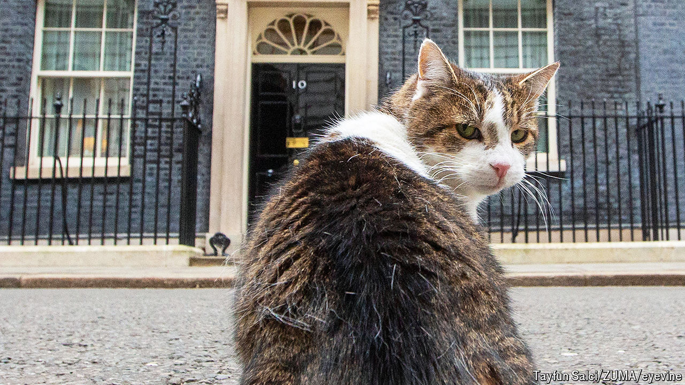

###### Onboarding

# Nukes and King Charles—but no door key 

##### The first 24 hours for a new British prime minister are odd, and busy 

 

> Jul 4th 2024 

It may well be the world’s least pleasant multiple-choice question. Imagine that London has been destroyed by a nuclear bomb. Millions of Londoners are dead. What Britain’s nuclear submarines do next is your decision. Do you a) retaliate? b) not retaliate? or c) wimp out, and let the submarine’s captain decide? If Labour wins the election on July 4th (this article was published before the results were known), at some point on the following day, in a room in 10 Downing Street, Sir Keir Starmer will have to answer this question. Then, very possibly, he will have to pop upstairs to his new flat to unpack his socks and decide where his sofa should go. 

A British prime minister’s first day is, to put it mildly, odd. If you are the French president you have a week or two to prepare for power; if you are the American, over two months. The British PM has about an hour. From the moment that an outgoing leader resigns, the incoming one begins a day that includes popping to Buckingham Palace; taking a call from the American president; moving house; and writing the “letters of last resort” in which each British PM decides what to do in the event of Armageddon. It is, says Alastair Campbell, Sir Tony Blair’s former spokesman, “a pretty stressful day”.

