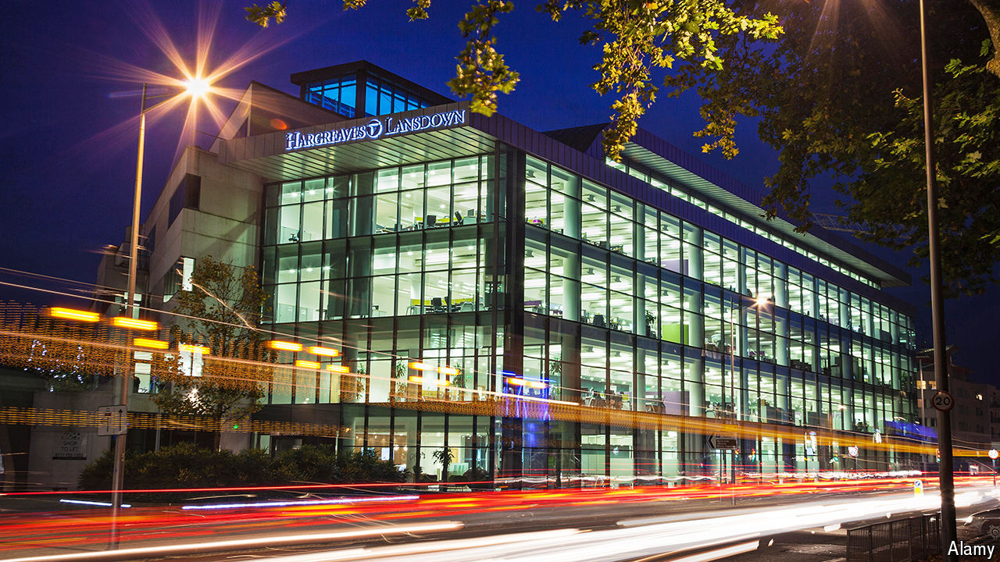

###### Deplatforming

# The woes of Hargreaves Lansdown, Britain’s DIY-investing titan 

##### A 17-year stint on the London Stock Exchange may soon come to an end 

 

> Jul 4th 2024 

On the face of it, Hargreaves Lansdown is still mightily successful. The financial-services firm enables British savers to buy shares, bonds and funds directly, as well as invest in tax-free vehicles and manage their pensions. A business that began with a borrowed typewriter in a spare bedroom in 1981 now has 1.8m clients, many of them wealthy baby-boomers. It boasts a 36% share of Britain’s do-it-yourself investment market and manages £142.2bn ($180bn) in assets under administration, dwarfing rivals such as AJ Bell, which oversees £80.3bn.

Yet its glory days are behind it. In the past year Hargreaves Lansdown has crashed out of the FTSE 100 index of most valuable companies on the London Stock Exchange, and lost a CEO and a chairwoman. Its share price is down by half from its peak in 2019, which has attracted the interest of would-be buyers. The company’s board has said it is minded to accept an offer from a consortium of private-equity funds, which includes CVC Capital Partners; they have been given until July 19th to table a binding offer. Peter Hargreaves, the company’s co-founder and still its largest shareholder, has blamed the firm’s previous management for the “shambles”. 

