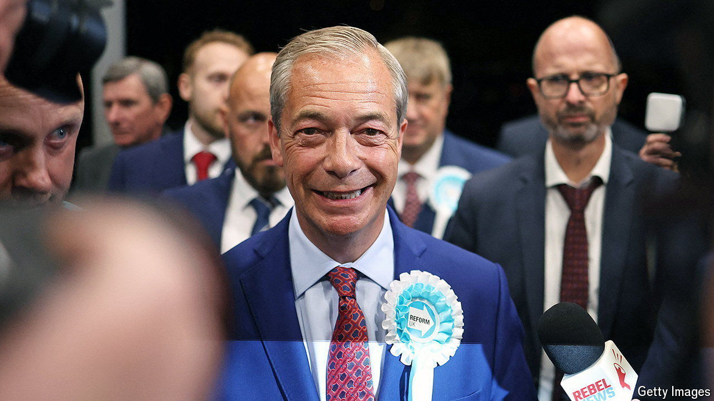

###### Bagehot

# What now for Britain’s right-wing parties? 

##### The Conservatives, Reform UK and the regressive dilemma 

 

> Jul 5th 2024 

Britain is, in general, ruled by the Conservative Party for a simple reason: small-“c” conservative voters unite behind one party, whereas progressive voters split themselves across many parties. Thinkers labelled this the “progressive dilemma”: until progressives learned to work together, they would be locked out of power. 

This rule was a good way to understand British politics until 10.01pm BST on July 4th, when the  and the  for the general election was released. Labour had underperformed its polling slightly, hitting only around 36% of the vote. For once, however, it was the right rather than the left that was fatally split. The Conservatives won around 23%, its lowest vote share in modern history. The reason? Nigel Farage’s populist Reform UK party, which won an estimated 17% of all votes cast. The result? A stonking majority of 170 for the Labour Party and the Conservative Party’s worst performance ever. The progressive dilemma no longer shapes British politics; the regressive dilemma now rules.


The first part of the regressive dilemma is for the Tories to decide what to do about Mr Farage and his insurgent party. Put simply, he must be buried or bedded. The Conservatives could go on the attack. They could charge Reform UK with being a tinpot operation whose candidates include cranks and racists. They could say that Mr Farage has dodgy views on everything from Russia to Donald Trump. Mr Farage insists he wants to destroy the Conservative Party. Why shouldn’t the Conservative Party fight back? 

The alternative is to woo him. It would be a political marriage of convenience. Mr Farage brings a unique charisma that was enough to persuade millions of British voters to support a party that barely exists beyond a skeleton staff. The Conservatives provide institutional heft and still command the support of one in four voters even after a period of wretched governance and a succession of economic shocks (some caused by the Conservatives themselves). What the Conservatives cannot do is continue with its current policy of aping Reform-style policies while insisting the party itself is beyond the pale. The Conservatives must pick either political murder or merger. 

Next, the Conservatives have to find a way to reconcile the contradictory urges of its voters. Historically, the Tory party is an alliance of the “City and the mob”: the party of businessmen and the party of unashamed nationalists. Today’s Conservatives have managed the astonishing feat of alienating both. 

Appeasing the City makes sense. The Conservatives are no longer the party of business. Management consultants who work one day a week from their large Oxfordshire homes should be natural Tories. Rich, liberal voters—who probably voted Remain and feel leery about some of the Conservative’s wilder positions on immigration—should be the keystones of the Conservative alliance. Yet they are deserting the party in droves. Brexit, for example, was a direct appeal to the mob, with the City paying the price. 

The consequences of annoying these voters were visible on July 4th. The Conservatives lost swathes of seats in the south-east of England. Rupert Harrison, George Osborne’s former adviser, is a man who would be cast as “Conservative chancellor” in a lazy BBC drama. But in Bicester and Woodstock, a seat that is home to Winston Churchill’s birthplace, he lost to the Liberal Democrats. Surrey Heath, another pleasant and once impeccably Tory land, also fell to Sir Ed Davey’s troops. 

Yet judging by the amount of votes won by Reform UK, the mob will not happily return to the Tories either. Their anger is understandable. These are red-blooded voters who want to see immigrants turned away and criminals brutalised; they were instead treated to record immigration and prisons so full that the party of law and order had to release people early to free up space. 

Some are optimistic that the regressive dilemma can be easily solved. Reform UK voters and Conservative voters have much in common. Both want to cut immigration. Both are intensely authoritarian. Both dislike Labour. Yet the similarities between, say, Green voters and Labour ones are also legion. Many Liberal Democrats are indistinguishable from their Labour peers. Beyond the constitutional question, an snp supporter and a Labour fan have much in common. The progressive dilemma showed that the narcissism of small differences is often the hardest to overcome. 

This lesson will take some time for right-wingers to learn. They will cling to comforting factoids, much as their progressive foes did. Did you know that, combined, the Conservative and Reform vote would have pipped Labour’s puny haul? Well, in the 1980s the combined vote share of Labour and the Social Democratic Party, a more moderate spin-off, comfortably outstripped that of Margaret Thatcher’s Conservative Party. That did not stop Thatcher wrenching the country to her will. It is little more than the psephological equivalent of: “If my mother had wheels, she would be a bike.”

Progressives were once a victim of the first-past-the-post system. Now they are its main beneficiaries. Labour won a stonking majority with a slightly higher share of the vote than it got in 2019, when it wound up with its worst post-war seat tally. David Cameron’s Conservatives won 36% in 2010 and failed to win a majority at all; the same number translated into a short-lived but fateful 12-seat majority in 2015. 

At times, first past the post is less a democratic method than a random number generator that spits out a slim or gigantic working majority for the government of the world’s sixth-largest economy. But talk of “hollow support” for Labour should be dismissed. Britain has the system it has. Each party knew the rules of the game and each party tried to win. Labour succeeded and for the next five years will have free rein to shape the country as it pleases. Whether this becomes a ten-year stretch will depend in part on a simple question: can the regressive dilemma be solved? ■


