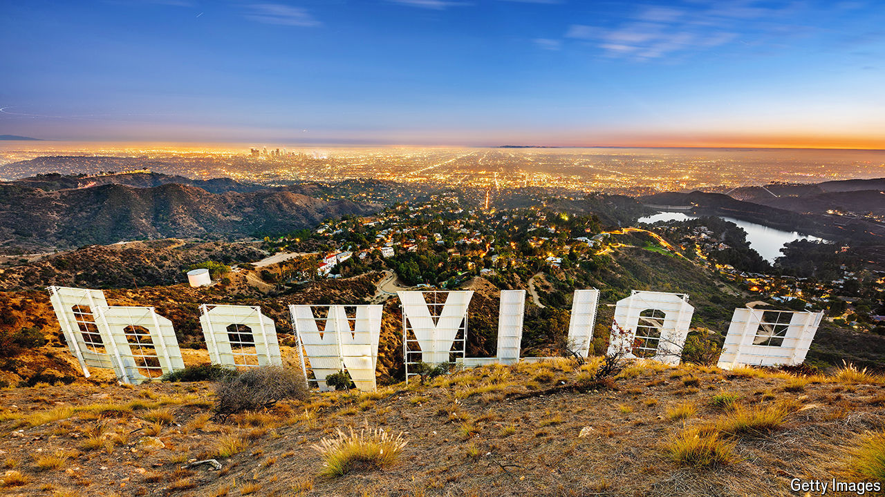

###### Erase and rewind

# Hollywood enters a frugal new era 

##### As austerity hits Tinseltown, rivalries are giving way to alliances 

 

> Jul 3rd 2024 

With sound-stage doors made big enough for performing elephants, the century-old Paramount Pictures lot on Melrose Avenue is a living museum of the film business. Now the studio, one of the world’s first—and the last still based in central —is for sale. Paramount’s controlling shareholder, Shari Redstone, is seeking a buyer for the teetering empire she inherited from her father Sumner, who died in 2020. For six months suitors have come and gone. On July 2nd it was reported that David Ellison, a tech heir whose previous bid for Paramount was rebuffed only in June, had reached a preliminary agreement to buy Ms Redstone’s stake in the company.

The turbulent picture at Paramount reflects the state of Hollywood.  has entered an age of austerity. Cinema is suffering from long covid; this year’s domestic box-office takings are forecast to be 30% lower than in 2019. Cable subscriptions are falling faster than ever, with a record 2.4m Americans cancelling their pay-TV in the latest quarter. 

