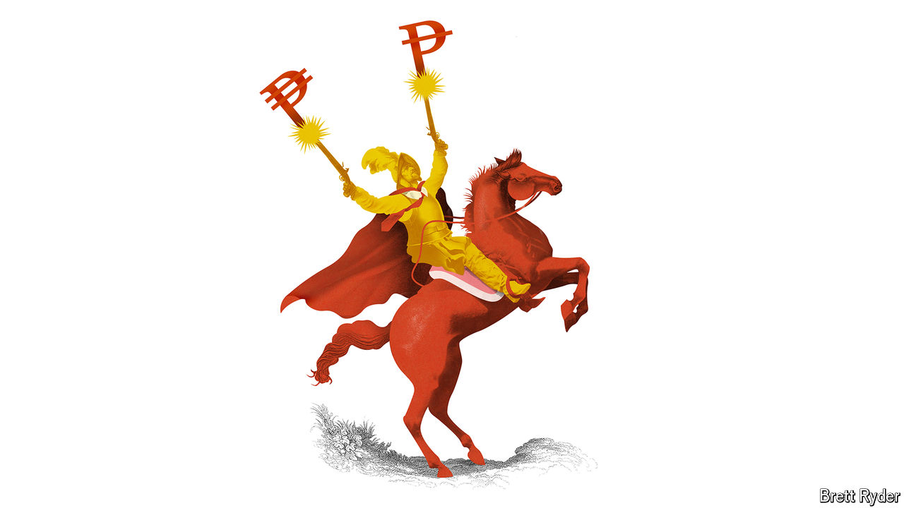

###### Schumpeter

# Lessons in risk-taking from buccaneering BBVA 

##### The Spanish lender places brave political bets at home and abroad 

 

> Jul 4th 2024 

Few bosses worry about European politics more than its bankers. In Italy and Spain new taxes have been levied as punishment for higher profits. The populist surge in France has redoubled concern. When Emmanuel Macron announced shock parliamentary elections in June, investors in French banks legged it. The final round of the election, held on July 7th, is likely to empower reckless spenders on the hard left or hard right. In an interview with Bloomberg in May, Mr Macron made a rare political pitch for a more integrated banking market, including cross-border deals. Now the sharp election-related fall in the price of France’s government debt has instead revived memories of the “doom loops” of the euro-zone crisis of the early 2010s, when worries about the solvency of sovereigns and of lenders fed off one another.

More volatile politics could make European banks even more parochial and less ambitious than they already are. One exception is Banco Bilbao Vizcaya Argentaria (BBVA), which cannot be accused of being either. The Spanish lender makes more than half its profit in Mexico. After Spain, its next largest market is Turkey, where the economy is so dire that BBVA uses “hyperinflation accounting” in its bookkeeping. And it is no shrinking violet at home. In May BBVA made a €12bn ($13bn) hostile offer to acquire Sabadell, a Spanish competitor it came close to buying in 2020.

