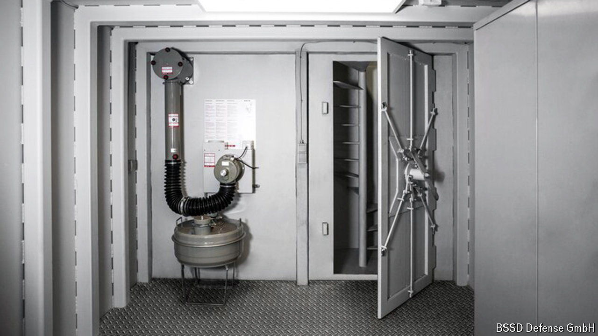

###### A bunker mentality

# Panic rooms and private bunkers are all the rage in Germany 

##### Everyone from tycoons to typical middle-class families seeks shelter 

 

> Jul 4th 2024 

KIM KARDASHIAN spotted the trend early, true to form. In 2021 the American reality-television star and her sister Khloé went bunker shopping. They tested a $200,000 facility made by a firm called Atlas Survival Shelters which provides 46 square metres (500 square feet) of safe space. Mark Zuckerberg, the billionaire founder of Meta, a social-media empire, is reportedly building a less cramped 450-square-metre facility under his ranch on a remote Hawaiian island. Now many Europeans, too, are running for cover. And not just plutocrats.

In the days after Russia’s invasion of Ukraine in February 2022 Bunkers Shelters Systems Germany (BSSD), a company in Berlin, began to receive as many as 1,000 calls a day from prospective clients. Created in 2014 and employing 100 people, it was the only German company making bunkers for private individuals when the Ukraine war began. Its founders, Mario and Katrin Piejde, quickly installed a hotline to deal with the barrage of requests. Since then its order book has swollen three-fold, as more Germans worry about various conflicts spinning out of control. 

