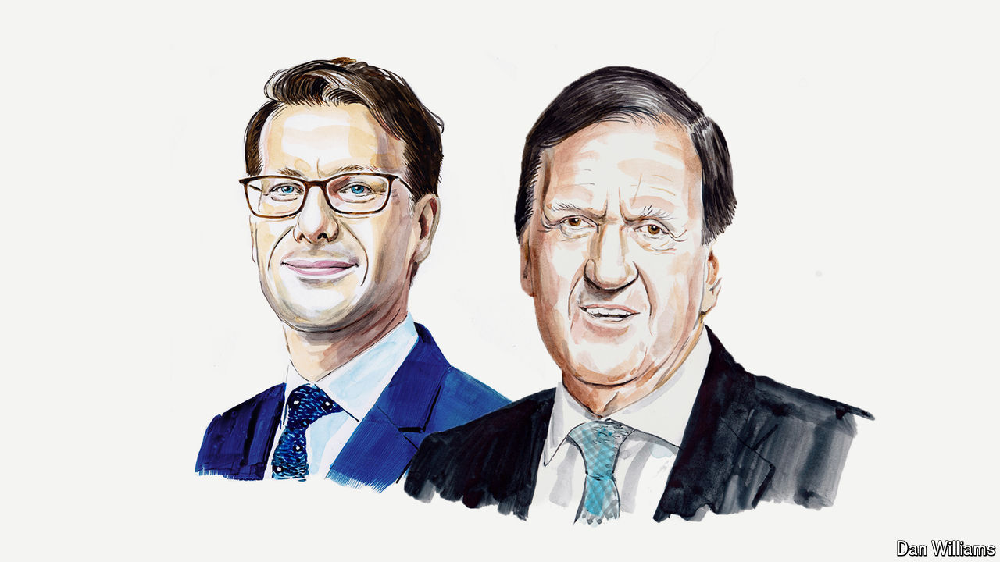

###### Europe’s other flashpoint

# NATO must tackle instability in the Balkans, says an ex-head 

##### Russia and China are up to old tricks in the region, argue George Robertson and Andi Hoxhaj 

 

> Jul 2nd 2024 

A FEW DAYS before Donald Trump is formally nominated as the Republican presidential candidate, the 32 members of the North Atlantic Treaty Organisation (NATO) will gather in Washington, DC to celebrate its 75th birthday. Even with a storm cloud of Trumpian scepticism looming over the military alliance, there will be plenty of cheering and self-congratulation.

NATO’s breadth and longevity are indeed remarkable. But the world is becoming increasingly fractious, with a mixture of old and new threats that range from nuclear sabre-rattling to hostile states targeting military research with cyber-attacks.

