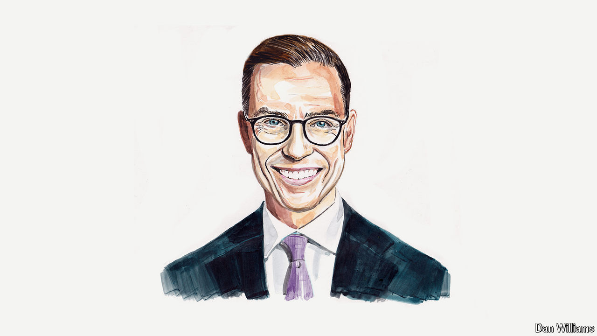

###### Geopolitics

# The West’s values are important, but so is realism, says Finland’s president 

##### The Global South must be courted, even if that means compromising interests, argues Alexander Stubb 

 

> Jul 4th 2024 

THERE ARE moments in international relations when we understand that the world is changing, but we do not yet know exactly where it is going—those moments when an era dies and a new one is yet to be born. We are living through one of them. The post-cold-war era is over. It ended with Russia’s war of aggression against Ukraine. The things that were supposed to bring us together—trade, technology, energy, information and currency—are now tearing us apart. 

Interdependence did not automatically lead to peace. Market economics did not translate into free trade. Freedom did not always mean liberal democracy. The West won the cold war but failed to convince the rest of the world to adopt the values it holds universal.

