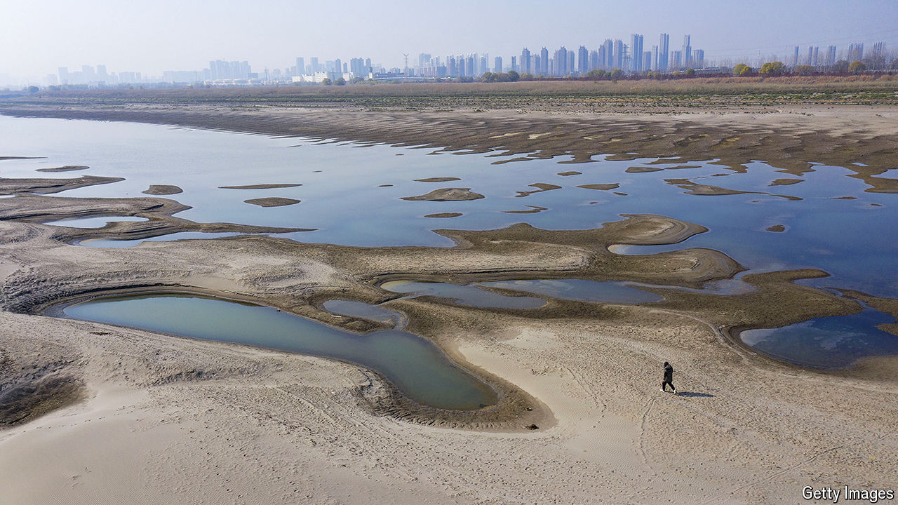

###### Worrying about water

# China is struck by floods and drought—at the same time 

##### A looming water crisis threatens everything from data centres to farms 

 

> Jul 1st 2024 

IN QUESHAN COUNTY, on the plains of central China, fields that are usually green with maize plants are brown and dusty. It has barely rained for two months and village wells are running dry. “We depend on the Emperor of Heaven to make a living,” says Yang Ning, a grizzled 67-year-old farmer, referring to a deity who controls the weather. “I don’t dare to hope.” The drought, which has affected eight Chinese provinces, is the worst many locals can remember.

A certain level of hardship is to be expected in parts of central and northern China. Most of the provinces in the north, where 40% of the country’s population lives, fall below the threshold for “water scarcity” set by the UN (see map). In the south torrential rains are more common. Flooding and landslides in the region killed dozens of people last month. Thousands had to be evacuated. But southern China has also been hit by droughts in each of the past three years. 

