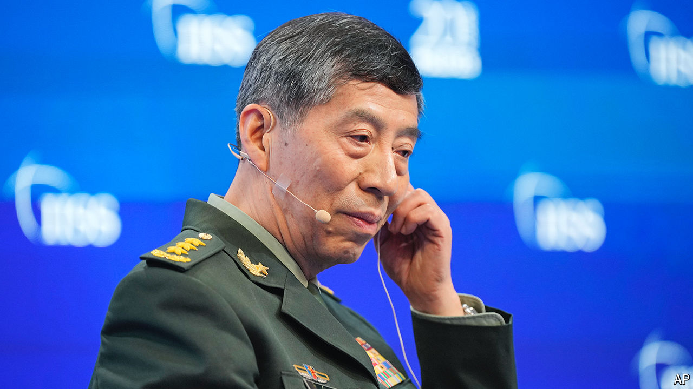

###### No defence

# How to provoke the fury of Xi Jinping 

##### Two former generals are accused of betraying the Communist Party 

 

> Jul 4th 2024 

FOR SENIOR Chinese officials charged with wrongdoing, the road to justice is often long and winding. The first step is usually detention, interrogation and an internal investigation conducted quietly by the disciplinary arm of the Communist Party. This triggers frantic but uninformed chatter about the official’s disappearance. Weeks or months later, state-controlled media confirm that he or she has been removed from their post and is under investigation. Some time after that it is announced that the official has been stripped of party membership. The matter then gets turned over to the justice system.

Two notable figures have now reached the end of that process. Li Shangfu (pictured) and Wei Fenghe are former generals in the People’s Liberation Army (PLA). Both men served as defence minister. Last summer they disappeared from public view and in the autumn Mr Li was removed from his post (Mr Wei had retired). On June 27th the official news agency, Xinhua, reported that they were being probed for “serious” crimes. Each man had accepted “a huge amount of money and valuables” in bribes, alleged investigators. The Politburo has expelled them from the party. They will now face criminal charges from military prosecutors.

