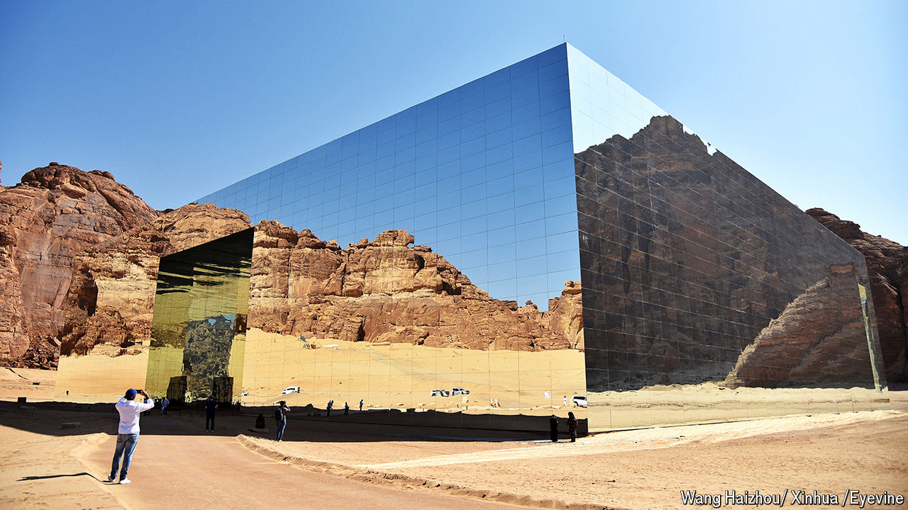

###### Call of the desert

# Can Saudi Arabia become a premier tourist hotspot? 

##### It has sun, sea and (lots of) sand. But people are wary of visiting the kingdom 

 

> Jul 4th 2024 

Recent events in Saudi Arabia have not been a good advert for tourism. Between 2m and 3m Muslims visit the country each year for the , the annual five-day pilgrimage that all Muslims aspire to do at least once. Last month, as temperatures exceeded 50°C, more than 1,300 people died, many from heat stress. The country’s authorities have been castigated for failing to take care of the pilgrims.

Despite the calamities this year, believers will still flock to the desert kingdom. In 2023 some 13.5m people came for the a lesser pilgrimage that takes place all year round. But for many non-Muslims, the conservative country is not high on their travel bucket lists. Saudi Arabia is better known for its crude-oil reserves, autocratic governance and use of the death penalty than for its sightseeing or luxury resorts.

