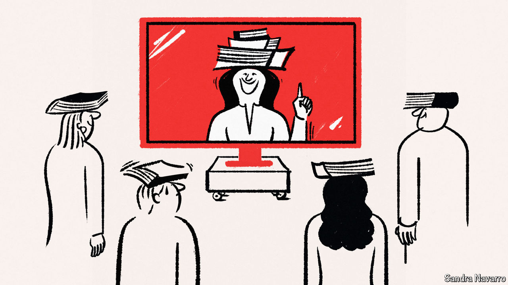

###### Manners maketh money

# Finishing schools for the age of TikTok 

##### Unsure how to be polite at work? Ask a digital etiquette guru 

 

> Jul 2nd 2024 

A CENTURY AGO, Emily Post made manners popular. Her bestselling book, “Etiquette” (1922), framed the “fundamentals of good behaviour” as fashionable rather than fusty; she offered practical advice (“when in doubt, wear the plainer dress”) as well as dramatic warnings (a young lady “unprotected by a chaperone” is like “an unarmed traveller walking alone among wolves”).

Readers were gripped. Post received thousands of letters a week. In 1950 , a magazine, named her the second-most powerful woman in America. (—at that point the chair of the UN commission on human rights—topped the list.)

