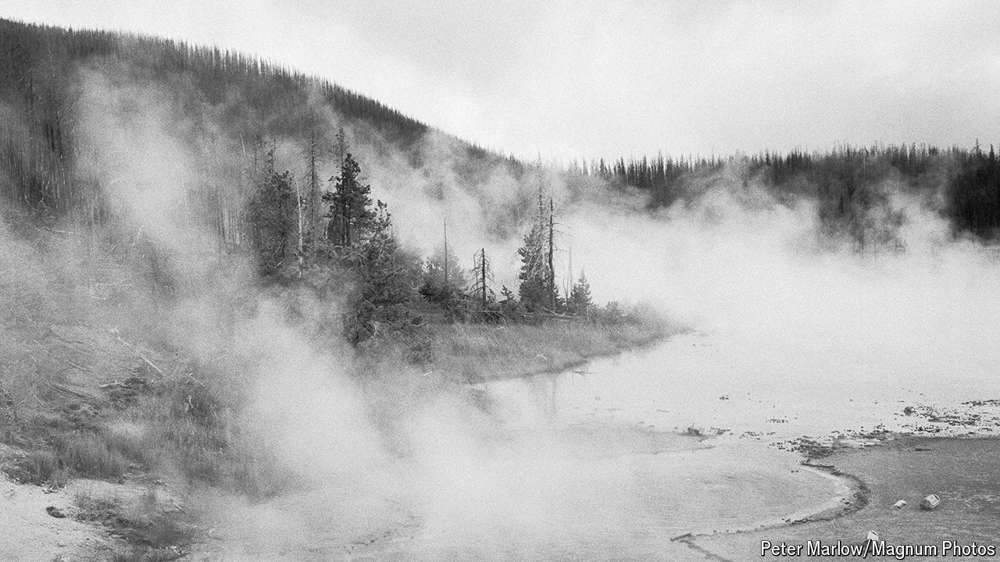

###### Melancholy in the mountains

# Like its Montana setting, Kevin Barry’s novel is brutal and gorgeous 

##### “The Heart in Winter” is the epitome of the Western love story 

 

> Jul 4th 2024 

By Kevin Barry. 

TOM ROURKE is a dope fiend with one foot already in the grave. He fancies himself a poet; the rest of Butte, Montana, fancies him a “mad little Irish motherfucker”. When he meets Polly Gillespie, newly wed to another man, both feel something shift. They don’t loiter long in Butte. The lovers strike out together for Pocatello, Idaho, from which they plan to ride the rails to San Francisco—and to freedom.

