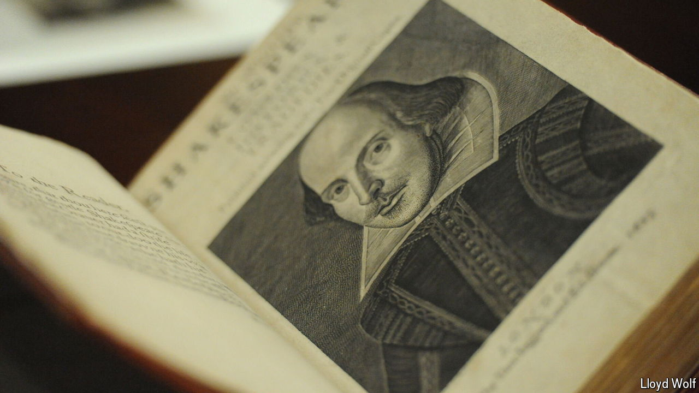

###### Not of an age, but for all time

# Making a case for Shakespeare, 400 years after his death 

##### The Folger library reopens, with a renewed purpose 

 

> Jul 1st 2024 

What is the world’s largest Shakespeare collection doing in Washington, DC? Across the street from the Library of Congress, diagonally opposite the Supreme Court, sits the Folger Shakespeare Library. At first glance, the large neoclassical block of white marble looks like another government building. Approach the entrance, however, and you will be greeted by a statue of Puck, the mischief-making sprite from “A Midsummer Night’s Dream”. At his feet, a quotation reads: “Lord, what fooles these mortals be!” 

The library was established by Henry and Emily Folger, Gilded Age philanthropists who spent their oil fortune obsessively collecting  and rare Shakespeare materials. After years of hoarding the collection in bank vaults, they decided to create a monument to Shakespeare in America’s capital. “The poet is one of our best sources, one of the wells from which we Americans draw our national thought, our faith and our hope,” Emily said. The  similarly adored Shakespeare, seeing in his tyrants the need for institutional checks on power.

