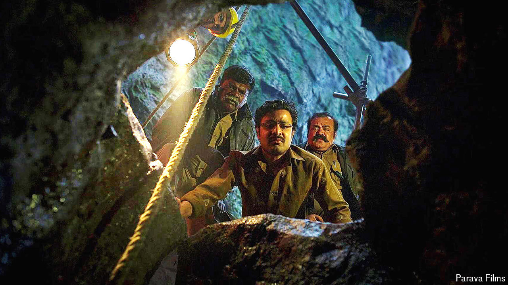

###### Stories from Kerala

# The rise of Mollywood, India’s more subtle film hub 

##### Instead of relying on big dance numbers, Malayalam movies tell stories 

 

> Jun 28th 2024 

To outsiders, and indeed many in the country, Indian cinema is all about  movies. Named after the blend of spices ubiquitous in the country’s cuisine, these films feature a mix of genres, formulaic plots and larger-than-life heroes. Most of India’s highest-grossing movies—many from , the behemoth Hindi-language film industry—can be classified as . But these big-budget, action-packed melodramas belie India’s diverse cinematic output. 

It is Mollywood which is leading the way in variety and sophistication. (The name nods to Malayalam, the language of Kerala state, where the film-makers are based.) It is arguably India’s most productive film industry: some 200 Malayalam films were released in 2023. Bollywood—which caters to around 500m Hindi speakers, 15 times Kerala’s population of 35m—produced roughly the same number. 

