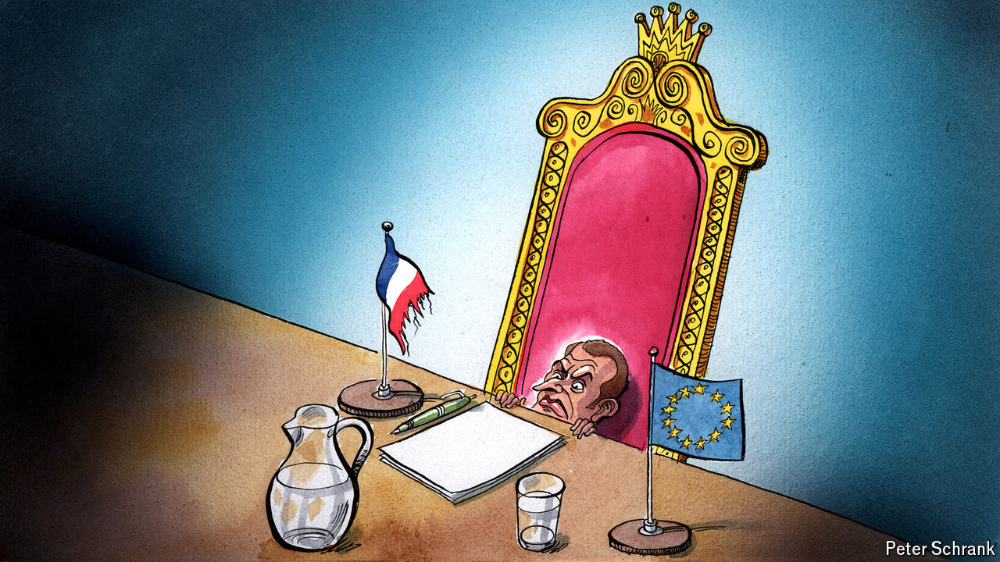

###### Charlemagne

# Europe faces a new age of shrunken French influence 

##### Sharing power will weaken the federalist president’s sway in Brussels 

 

> Jul 4th 2024 

In 1965 an imperious president of France all but derailed the European project by means of an “empty chair”, vetoing any schemes cooked up in Brussels by simply refusing to send French officials to any meetings there. In 2024 a no-less-imperious French president is hoping to go one better: to fill France’s chair in European Union meetings with ministers who will be either powerless to act or decry the EU as a globalist plot. Back then Charles de Gaulle relented after six months, once he was satisfied that lesser Europeans would not be able to impose their will on the French. Alas, the forthcoming crisis induced by Emmanuel Macron’s decision to call (and then get trounced in) snap elections is likely to last far longer. Talk of Frexit, now or later, is overdone. But the effect of the sitting president losing his authority in Europe—call it “Macroff”—is still a blow for the union. France, for years a driving force in the EU, is likely to become a handbrake.

The shape of France’s future relationship with the union will depend on the second round of voting in legislative elections on July 7th. The biggest fear in Brussels and just about every EU capital bar Budapest is that the National Rally (RN) of Marine Le Pen will win a majority after coming top in the first round. Its flagship policy until 2017 was to leave the EU altogether. Until even more recently it wanted to pull out of NATO’s integrated military command structure, which de Gaulle huffed out of shortly after the empty-chair spat. (Nicolas Sarkozy, another imperious French president—attentive readers may be spotting a trend here—rejoined in 2009). If the RN is the biggest party but falls short of a majority, as seems likely, it may still be able to cobble together a “national conservative” coalition oozing Euroscepticism. 

