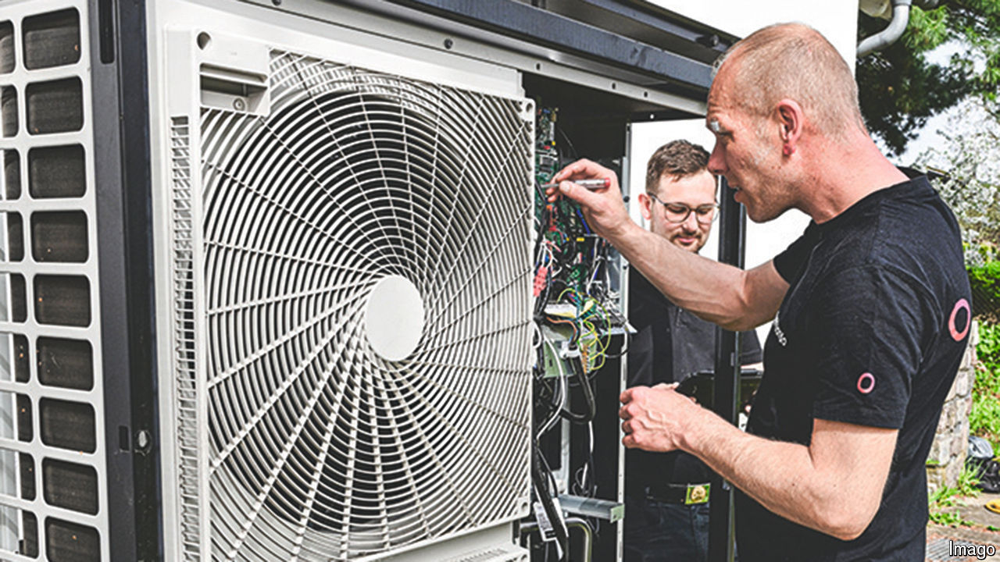

###### Green policies

# The EU should be the world’s heat-pump pioneer 

##### But the union is falling behind in its efforts 

 

> Jul 4th 2024 

Fearing for her reappointment, Ursula von der Leyen, boss of the European Commission, the EU’s executive arm, soft-pedalled over unpopular green policies in the run-up to the European Parliament elections on June 9th. Mrs von der Leyen had proclaimed in 2019 that the EU Green Deal, the union’s strategy to achieve net-zero carbon emissions by 2050, was the EU’s “man-on-the-moon moment”.

But in February she blocked a draft law to slash the use of pesticides in farming, and loosened some of the environmental strings tied to the subsidies of the EU’s common agricultural policy. Still more striking was her decision to delay publication of a heat-pump action plan that had been scheduled for early in the year to an unspecified time after the elections.

