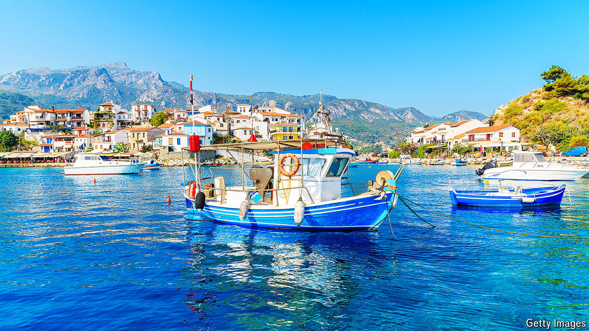

###### Send in the Turks

# Turkish tourists can now easily visit nearby Greek islands 

##### A cheering sign of reduced tension in the eastern Mediterranean 

 

> Jul 4th 2024 

FOR YEARS Ahmet Bayrakli could look at the Greek island of Samos only from his hometown of Kusadasi, on Turkey’s western coast. Despite the tiny distance between them—1,650 metres at the closest point—he was unable to travel there without getting a full Schengen visa, an increasingly difficult process for Turks. Since April, however, the doors of ten Greek islands, including Samos, have been flung open with a special “gate” visa that lets Turks stay for seven days. Mr Albayrak is one of tens of thousands who have taken advantage. 

“It was ridiculous before—this is our neighbour,” he said, as he joined the queue for the morning ferry, which crosses from Kusadasi to Samos Town, the island’s capital, in 90 minutes.

