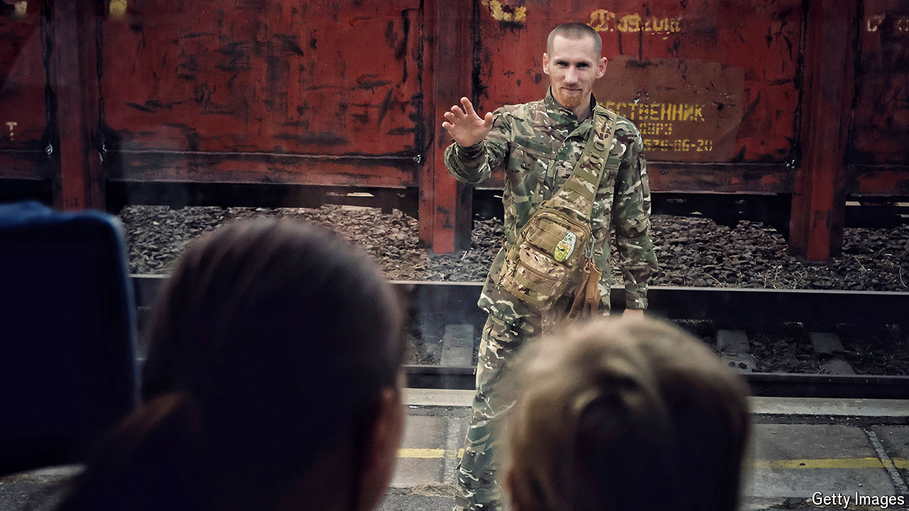

###### A black hole

# Ukraine’s war has created millions of broken families 

##### Children and wives have been apart from their fathers and husbands for more than two years 

 

> Jul 2nd 2024 

ACCORDING TO A survey conducted this year by the International Rescue Committee (IRC), an organisation that supports refugees all over the world, an astonishing 74% of Ukrainians report being separated from a close family member because of the war. 

Anna Gorozhenko, a historical novelist, and her daughter, Yara, then just seven, fled the Russian advance and left their home in a Kyiv suburb in February 2022, just after the war started. Under martial law Ukrainian men between the ages of 18 and 60 cannot leave the country except by special permission; and so they had to leave Anna’s husband, Alex, behind. 

