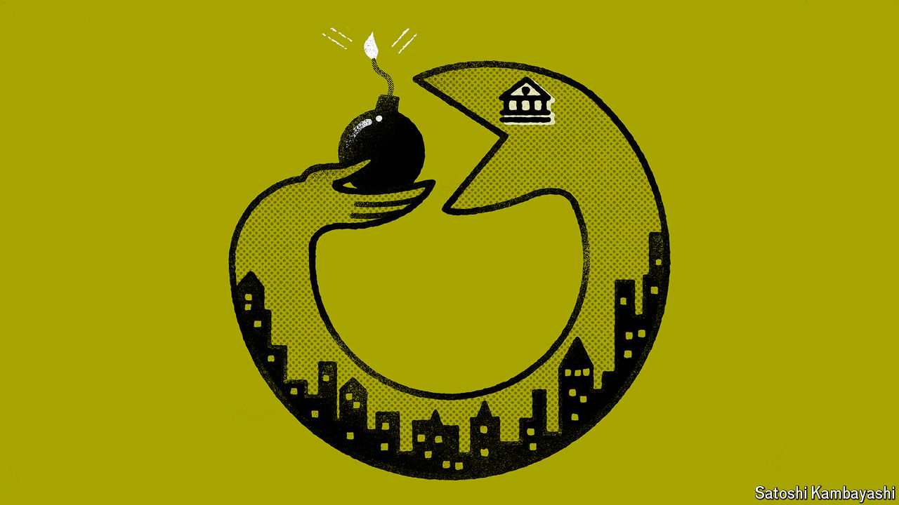

###### Buttonwood

# America’s banks are more exposed to a downturn than they appear 

##### To understand why, consider the ouroboros theory of financial risk 

 

> Jul 4th 2024 

The earliest depiction of the ouroboros—a serpent coiled in a circle, eating its own tail—was found in the tomb of Tutankhamun, a pharaoh who ruled Egypt around 1320BC. It was used in his funerary texts to depict the infinite nature of time, and later cropped up all over the place. In Ancient Rome it signified the seasonal cycle of the calendar year; in Norse mythology the snake was large enough to encircle the world. The idea is also an allegory for the modern financial system. It depicts how credit risk has been cycled out of banks, only to be gobbled up by them once more.

After the global financial crisis of 2007-09, lawmakers in America and Europe penned new rules to govern finance. These had two aims. First, to force banks to hold more capital against their assets, so as to cushion losses. Second, to curb the risky activities in which banks had indulged. Some, such as proprietary trading, were prohibited; others were simply discouraged, sometimes by assigning higher “risk weights” to spicier assets. Both aims are measured by “common equity tier 1 capital” or cet1, which divides bank equity by asset value, adjusted for risk weights.

