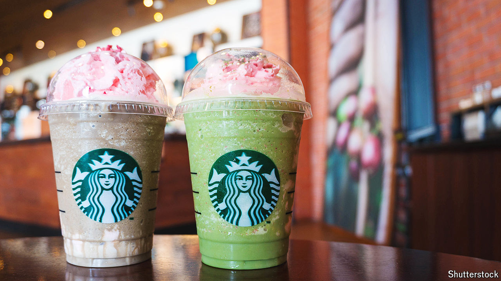

###### Business creation

# How Starbucks caffeinates local economies 

##### Call it the frappuccino effect 

 

> Jul 4th 2024 

Starbucks offers endless opportunities for innovation. Parts of social media delight in hacking the chain’s menu to create highly instagrammable drinks. Fancy a “cake batter Frappuccino”? Simply order a “vanilla bean crème Frappuccino”, add a pump of hazelnut syrup and ask the barista to put a cake pop in the blender. How about some “liquid cocaine”? That involves four shots of espresso with four pumps of white-chocolate syrup, served over ice.

A new working paper suggests the purveyor of coffee-based milkshakes offers other innovation, too. Choi Jinkyong, Jorge Guzman and Mario Small, all of Columbia University, find that a new Starbucks in an American neighbourhood without a coffee shop leads to the creation of between 1.1 and 3.5 new companies a year over the next seven years. That, the authors argue, owes to the café’s role as a “third place”—somewhere people can gather without a purpose. Branches “help entrepreneurs form and mobilise networks”, they write. 

