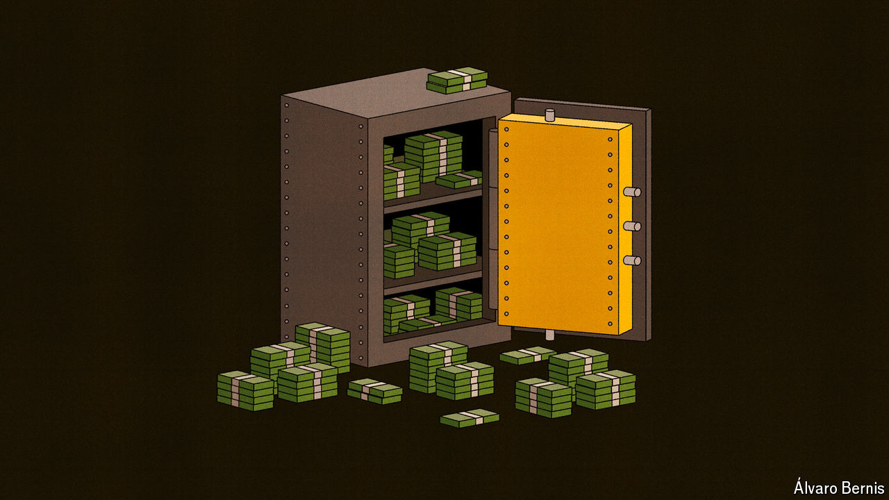

###### Free exchange

# How much cash should be removed from the financial system? 

##### Undoing quantitative easing provokes fierce debate 

 

> Jul 4th 2024 

The world is still, in a sense, swimming in cash. Or at least the electronic equivalent: central-bank reserves. The Bank for International Settlements (BIS), a club of central banks, estimates that the balance-sheets of rich-country central banks amount to roughly 50% of collective GDP. That is down from 70% in 2021—a reduction which reflects quantitative tightening (QT), or the offloading of assets acquired while easing—but is still far above the pre-global-financial-crisis norm of around 10%. 

Qt is intended to enhance the disinflationary effect of raising interest rates. As assets roll off a central bank’s balance-sheet, the corresponding reserves are extinguished. The process should, in the words of Janet Yellen, America’s treasury secretary and a former chair of the Federal Reserve, be as interesting as watching paint dry. Yet if reserves are to return to anything like their earlier 10% level, that may not be the case. Some worry such a reduction would prompt nasty surprises in the financial system. Hawkish types nevertheless argue that central banks ought to ensure reserves once again become “scarce”. They suggest that the “abundant” era created by quantitative easing has been destabilising, since banks no longer need to economise on their holdings or rely on the disciplining effects of money markets. 

