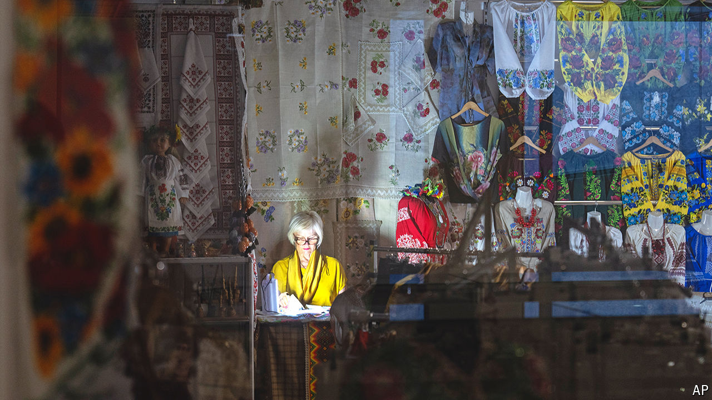

###### In the wars

# Ukraine has a month to avoid default 

##### Lending to a borrower at war entails an additional gamble: that it will win 

 

> Jun 30th 2024 

War is still exacting a heavy toll on Ukraine’s economy. The country’s GDP is a quarter smaller than on the eve of Vladimir Putin’s invasion, last year the central bank tore through foreign reserves and Russia’s attacks on critical infrastructure have hurt growth forecasts. “Strong armies”, warned Sergii Marchenko, Ukraine’s finance minister, on June 17th, “must be underpinned by strong economies.” 

After American lawmakers’ decision in April to belatedly approve a  worth $60bn, Ukraine is not about to run out of weapons. In time, the state’s finances will also be bolstered by G7 plans, which were announced on June 13th, to use the profits from  in Western financial institutions to lend another $50bn. The problem is that Ukraine faces a cash crunch—and soon.

