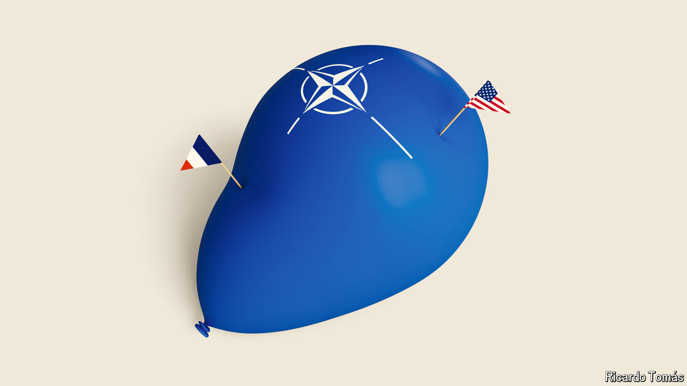

###### Fickle friends

# Donald Trump and Marine Le Pen will haunt NATO’s 75th birthday party 

##### Threats to Western alliances lie both within and without the club 

 

> Jul 4th 2024 

AT HIS FIRST summit with European leaders in 2021, after years of upheaval under Donald Trump, Joe Biden exulted: “America is back.” To which Emmanuel Macron of France asked: “For how long?” The question will resonate more loudly than ever as NATO leaders meet in Washington on July 9th-11th. Mr Biden is limping behind Mr Trump in the race for the White House. Mr Macron himself is being overwhelmed by a populist wave. And the German chancellor, Olaf Scholz, is languishing in the polls. Sir Keir Starmer, set to become Britain’s new prime minister this week, may feel he is joining NATO’s last supper, not its 75th birthday party.

It was all supposed to be very different: a celebration of the world’s most successful alliance, created in 1949 in the early days of the cold war. Its longevity has defied naysayers for decades. And its purpose has been bitterly re-affirmed by Russia’s all-out invasion of Ukraine. Yet NATO again lives in dread for its future. Partly this is owing to external threats, but mainly it is because of the internal convulsions that will result if NATO-sceptics such as Mr Trump and Marine Le Pen, leader of the hard-right National Rally, come to power next year and in 2027, respectively.

