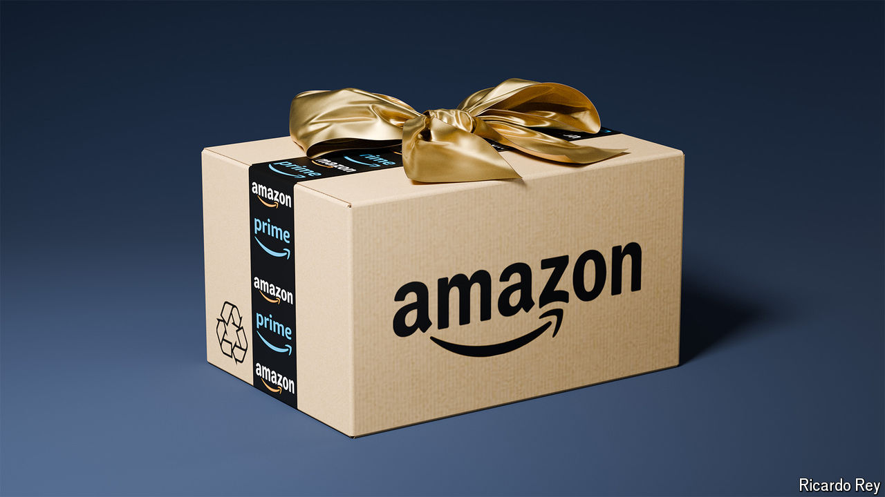

###### Everything in store

# As Amazon turns 30, three factors will define its next decade 

##### It will have to deal with trustbusters, catch up on AI and revive its core business 

 

> Jul 4th 2024 

About a week ago Amazon joined an exclusive club. Its market value ticked over $2trn, putting it in the company of only four other firms: Alphabet, Apple, Microsoft and Nvidia. In its 30 years Amazon, which began life as an online bookseller in Seattle on July 5th 1994, has been astonishingly successful. Its network of warehouses and vans delivers more packages each year than FedEx or UPS, equivalent to $850bn-worth of goods worldwide. Its pioneering cloud-computing business is used by millions of customers and generates annual revenues of $100bn. Beyond its core operations, it is investing in delivery drones, satellite networks and self-driving cars. 

This success is the result of the company’s tireless focus on customers and its enthusiasm for experimenting. Activists may complain about how it kills off brick-and-mortar stores. But punters are delighted with their sackfuls of smiling cardboard boxes; Amazon routinely tops customer-satisfaction surveys. In its quest to please shoppers, it diligently ploughs its profits back into its business. Last year no firm spent more on research and development or capital expenditure than Amazon. Plenty of companies say they are customer-obsessed. But for Amazon, that claim actually rings true. 

