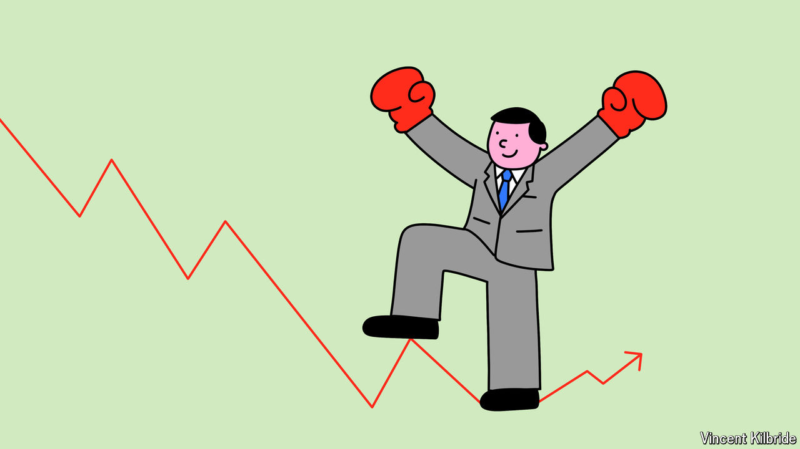

###### The end of the beginning

# Central banks are winning the battle against inflation. But the war is just getting started 

##### Politics and protectionism will make life difficult 

 

> Jul 4th 2024 

The trajectory of inflation has not given central bankers much cause for celebration in recent years. But at the European Central Bank’s annual jamboree in Sintra, Portugal, this week, a touch of self-congratulation has been in the air. “I know it sounds a little bit arrogant,” confessed Christine Lagarde, the ECB’s president, on July 1st, but the unwinding of high inflation “is remarkable”. “We’ve made a lot of progress,” said Jerome Powell, the chairman of America’s Federal Reserve, the next day. Others agree. “Central banks have risen to the challenge” of high inflation, commends the Bank for International Settlements. 

The data do indeed merit some satisfaction. After cumulative price increases between 2021 and 2023 of 15% in America and 18% in the euro zone, annual inflation rates now stand at just 2.6% and 2.5% respectively. Yet the time for mutual back-patting may be brief. Lower inflation, though welcome, does not mean a return to the relatively stable economy that prevailed before the pandemic. Several perils loom on the supply side, which could constrain growth and boost inflation, just as a return to populism in America and Europe threatens fiscal blowouts and more price pressure still. Central bankers may be winning the battle against inflation. The war is just beginning.

